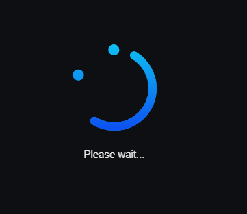
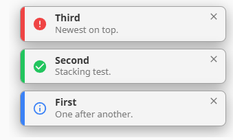
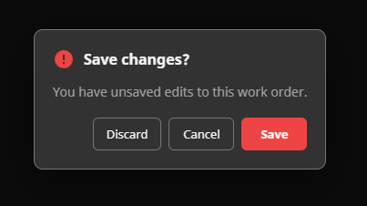
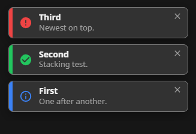
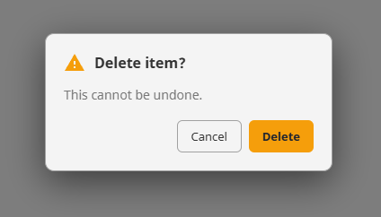
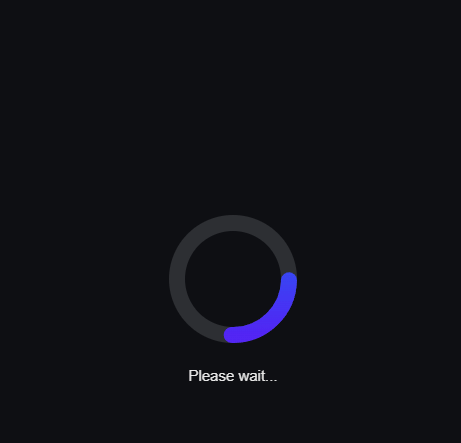
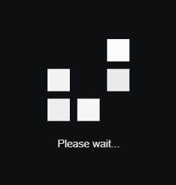
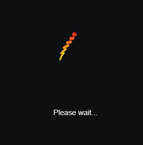

# Ectobox Alerts

Script-invoked, **session-global UI for Ignition 8.3 Perspective** — the pieces Perspective doesn't
give you out of the box. One module, one drop-once component, three controls you fire from any
script (component event, binding, tag event, or gateway script):

- **Toasts** — a stacking, auto-dismissing notification.
- **Message boxes** — a modal dialog with custom buttons that delivers the user's choice back.
- **Loading overlays** — a full-screen blocking overlay with an animated spinner.

```python
system.ectobox.alerts.ShowToast("Saved", "Your changes were saved.", "success")
system.ectobox.alerts.ShowMessageBox("Delete item?", "This cannot be undone.", "warn", ["Cancel", "Delete"])
system.ectobox.alerts.ShowLoading("arcs", "Saving...")   # ... then CloseLoading() when the work is done
```

All three render into body-level portals, animate in and out, follow the gateway's light/dark theme,
and ship **all** their CSS (including `@keyframes`) inside the module — there's nothing to add to a
project theme.






## What's included

| Surface | Functions | Notes |
|---|---|---|
| **Toast notifications** | `ShowToast` | Stacks, auto-dismisses, 4 types, 6 placements. |
| **Modal message boxes** | `ShowMessageBox` | Custom buttons; the choice comes back asynchronously as a session message. |
| **Loading overlays** | `ShowLoading` / `CloseLoading` | Full-screen, blocking, with a library of CSS/SVG spinners. |
| **Autocomplete constants** | `…types.*`, `…spinners.*` | Type + spinner names as documented constants, so you don't memorize strings. Though they are in the intellisense. |

## How it works

Perspective has no session-global UI layer, so you drop one lightweight **Alert Host** component onto
a page (or once into an inherited shell/dock). It renders nothing until something fires. Any
`system.ectobox.alerts.*` call broadcasts a Perspective session message; the host hears it
gateway-side and renders the toast / message box / loading overlay into a **body-level portal** —
stacked, animated, and self-managing. All CSS (including animations) ships in the module bundle, so
there's nothing to add to a project theme.

The host is a **document-level singleton** for all three surfaces: dropping it more than once on a
page can't produce duplicates (alerts dedupe by id), so it degrades gracefully if you over-place it.

## Install

1. Download **`Ectobox-Alerts-8.3.modl`** from the [Releases](https://github.com/Ectobox/EctoboxIgnitionModules/releases/download/modules/Ectobox-Alerts-8.3.modl) list.
2. Gateway → **Config → Modules → Install or Upgrade a Module** → pick the file.
3. In the Designer, **Alert Host** appears in the palette under the **Ectobox** category.

## Quick start

1. Drop an **Alert Host** onto each page that should show alerts — or once into a dock/shell your
   pages inherit. It's invisible at runtime; toast placement/animation are configured on the host.
2. From any event, binding, or gateway script, call `ShowToast`, `ShowMessageBox`, or
   `ShowLoading`/`CloseLoading`.

```python
# From a component event (button onClick, validation, etc.) — targets the current session automatically:
system.ectobox.alerts.ShowToast("Saved", "Your changes were saved.", "success")
system.ectobox.alerts.ShowToast("Validation error", "You must specify a last name.", "error", 5000)

# The type/spinner strings are also autocomplete-friendly constants (use whichever you prefer):
system.ectobox.alerts.ShowToast("Saved", "Your changes were saved.", system.ectobox.alerts.types.SUCCESS)

# From gateway scope (tag event, gateway timer) — pass the target session:
system.ectobox.alerts.ShowToast("Heads up", "Batch finished.", "info", 3000, sessionId=sid, pageId=pid)
```

> **Positional or keyword — your choice.** Every argument can be passed by name, so you can skip the
> optional middle ones: `ShowToast("Saved", "Done.", duration=8000)`. The Designer's script editor shows
> each function's real parameter names and descriptions in autocomplete.

## `system.ectobox.alerts.ShowToast`

`ShowToast(title, message, [type], [duration], [sessionId], [pageId])`

| Arg | Type | Default | Notes |
|---|---|---|---|
| `title` | `str` | `""` | Bold heading line. |
| `message` | `str` | `""` | Body text. |
| `type` | `str` | `"info"` | `info`, `success`, `warn`, or `error` — sets the accent color and icon. Or a `system.ectobox.alerts.types.*` constant. |
| `duration` | `int` | host `defaultDuration` | Milliseconds before auto-dismiss. `0` = sticky (stays until the user closes it). |
| `sessionId` | `str` | current session | Target a specific session (required from gateway scope with no current session). |
| `pageId` | `str` | all pages | Narrow to one page — see [Scope: session vs. page](#scope-session-vs-page). |




## `system.ectobox.alerts.ShowMessageBox`

`ShowMessageBox(title, message, [type], [buttons], [resultType], [sessionId], [pageId])`

Pops a modal dialog (backdrop, icon by `type`, title, message, buttons). The result is **asynchronous** —
when the user clicks a button, the Alert Host posts a Perspective session message carrying
`{id, button, buttonIndex}`. Add a message handler for `resultType` to react.

| Arg | Type | Default | Notes |
|---|---|---|---|
| `title` / `message` | `str` | `""` | Heading + body. |
| `type` | `str` | `"info"` | `info`/`success`/`warn`/`error` — icon + primary-button accent. Or a `system.ectobox.alerts.types.*` constant. |
| `buttons` | `list[str]` | `["OK"]` | Button labels, left→right. The **last** button is styled primary. |
| `resultType` | `str` | `ectobox.alerts.messageBoxResult` | Message type posted with the choice. |
| `sessionId`/`pageId` | `str` | current session / all pages | Target a session (required from gateway scope); `pageId` narrows to one page — see [Scope](#scope-session-vs-page). |

```python
# Show a confirm:
system.ectobox.alerts.ShowMessageBox("Delete item?", "This cannot be undone.", "warn", ["Cancel", "Delete"])

# React to the choice — add a message handler for 'ectobox.alerts.messageBoxResult':
clickedButton = payload.get("button")   # None if dismissed (Escape)
if clickedButton == "Delete":
    ...  # do the delete
```




## `system.ectobox.alerts.ShowLoading` / `CloseLoading`

`ShowLoading(spinner, [text], [dismissible], [sessionId], [pageId])` — a full-screen **modal loading
overlay** that blocks all interaction, with an animated spinner and optional caption.
`CloseLoading([sessionId], [pageId])` removes it. Use them around long work:

```python
system.ectobox.alerts.ShowLoading("smile", "Saving...")
try:
    # ... do the slow thing ...
finally:
    system.ectobox.alerts.CloseLoading()

# dismissible=True lets the user bail out with the Escape key:
system.ectobox.alerts.ShowLoading("rainbow", "Loading...", dismissible=True)
```

| Arg | Type | Default | Notes |
|---|---|---|---|
| `spinner` | `str` | `"arcs"` | Spinner id (see below). Unknown ids fall back to `arcs`. |
| `text` | `str` | `""` | Caption shown under the spinner. |
| `dismissible` | `bool` | `False` | If `True`, the user can close the overlay with the **Escape** key. Otherwise only `CloseLoading()` removes it. |
| `sessionId`/`pageId` | `str` | current session / all pages | Target a session (required from gateway scope); `pageId` narrows to one page — see [Scope](#scope-session-vs-page). |

**Spinners** (pure CSS/SVG): `smile`, `acrobat`, `arcs`, `blocks`, `fire`, `offtracks`,
`rainbow`, `twist`.






Spinner names are also autocomplete-friendly constants — see **Constants** below.

## Scope: session vs. page

A Perspective **session** spans every tab/page open in the same browser — so by **default an alert shows
on all of them**. That's usually what you want for a toast, but a loading overlay or a confirm dialog often
belongs to just the page that triggered it. Pass **`pageId`** to scope an alert to a single page:

```python
# Just this page (e.g. block only the tab that kicked off the work):
system.ectobox.alerts.ShowLoading("arcs", "Saving...", sessionId=self.session.props.id, pageId=self.page.id)
...
system.ectobox.alerts.CloseLoading(sessionId=self.session.props.id, pageId=self.page.id)

# Omit pageId -> shows on every open page of the session (the default).
system.ectobox.alerts.ShowToast("Saved", "Your changes were saved.", "success")
```

- From a Perspective component/session event, the current page id is **`self.page.id`**.
- From gateway scope (tag event, timer), enumerate a session's pages via
  `system.perspective.getSessionInfo()` (the `pageIds` field) and pass the one you want.
- A separate browser — or the Incineration Client's embedded WebView — is a **different session**, so
  alerts never cross that boundary regardless of `pageId`.

## Constants (strings or autocomplete)

Every "pick one of these strings" argument accepts **either** the raw string **or** a documented
constant, so you can lean on the Designer's autocomplete instead of remembering the exact spelling.
Both forms are identical at runtime — the constants just evaluate to the string.

| Namespace | Constants | Used by |
|---|---|---|
| `system.ectobox.alerts.types` | `INFO`, `SUCCESS`, `WARN`, `ERROR` | the `type` arg of `ShowToast` / `ShowMessageBox` |
| `system.ectobox.alerts.spinners` | `SMILE`, `ACROBAT`, `ARCS`, `BLOCKS`, `FIRE`, `OFFTRACKS`, `RAINBOW`, `TWIST` | the `spinner` arg of `ShowLoading` |

```python
# These two lines do exactly the same thing:
system.ectobox.alerts.ShowToast("Saved", "Done.", "success")
system.ectobox.alerts.ShowToast("Saved", "Done.", system.ectobox.alerts.types.SUCCESS)

system.ectobox.alerts.ShowLoading(system.ectobox.alerts.spinners.RAINBOW, "Loading...")
```

## Alert Host properties

These configure the **toast** stack (message boxes and loading overlays are centered modals and need no
host config). Set them on the Alert Host component.

| Property | Type | Default | Notes |
|---|---|---|---|
| `placement` | `enum` | `top-right` | `top-right`, `top-left`, `top-center`, `bottom-right`, `bottom-left`, `bottom-center`. |
| `newestOnTop` | `boolean` | `true` | New toast enters at the leading edge; older ones shift away. |
| `defaultDuration` | `integer` | `3000` | Fallback auto-dismiss (ms) when `ShowToast` omits `duration`. `0` = sticky. |
| `maxVisible` | `integer` | `5` | Cap on simultaneous toasts; the oldest is dropped to make room. `0` = unlimited. |
| `style` | `object` | `{}` | Standard Perspective style prop. |

## Theming / CSS

All styling ships in the module bundle. Surfaces follow the gateway's light/dark theme through
Perspective's CSS variables (`--container`, `--neutral-90/60`, `--border`, …), and the four type
accents are fixed colors: `info #3b82f6`, `success #22c55e`, `warn #f59e0b`, `error #ef4444`. Override
anything by targeting these prefixed classes from a project stylesheet.

**Toasts**

| Class | Purpose |
|---|---|
| `.ecto-alert-overlay` | The fixed, click-through stack container (portaled to `<body>`); `--top-right` / `--top-left` / `--top-center` / `--bottom-right` / `--bottom-left` / `--bottom-center` set the anchor. |
| `.ecto-toast` | A toast card. Type modifiers `--info` / `--success` / `--warn` / `--error`; `--leaving` while dismissing. |
| `.ecto-toast__stripe` / `__icon` / `__body` / `__title` / `__message` / `__close` | Card parts. |

**Message box**

| Class | Purpose |
|---|---|
| `.ecto-mb-backdrop` | Full-screen dimmed backdrop (portaled to `<body>`, above toasts). |
| `.ecto-mb` | The dialog card. Type modifiers `--info` / `--success` / `--warn` / `--error` accent the icon + primary button. |
| `.ecto-mb__header` / `__icon` / `__title` / `__message` / `__buttons` | Dialog parts. |
| `.ecto-mb__button` | A button; `--primary` styles the last (primary) button. |

**Loading overlay + spinners**

| Class | Purpose |
|---|---|
| `.ecto-loading-backdrop` | Full-screen blocking backdrop (above toasts + message box). |
| `.ecto-loading` / `.ecto-loading__spinner` / `.ecto-loading__text` | Overlay content, the spinner slot, and the caption. |
| `.ecto-spin--<id>` | One class per spinner (`smile`, `acrobat`, `arcs`, `blocks`, `fire`, `offtracks`, `rainbow`, `twist`); each spinner's animation lives under it with `ecto-<id>-*` keyframes. |

> Z-order is layered so the surfaces stack sensibly: toasts (`13000`) < message box (`13001`) <
> loading overlay (`13002`).
