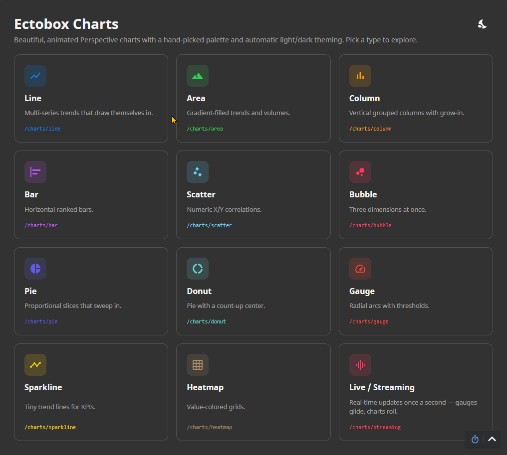
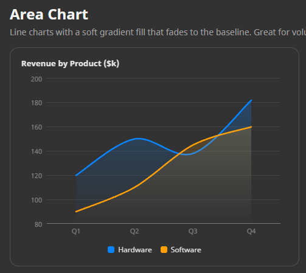
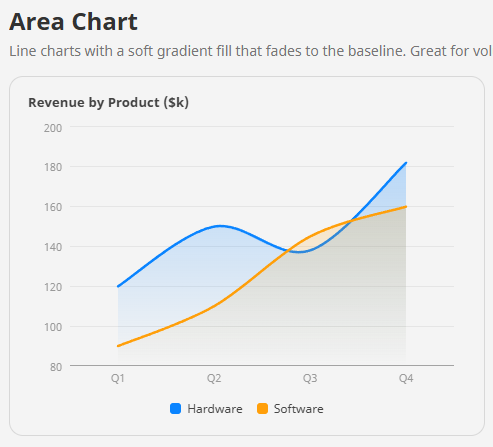
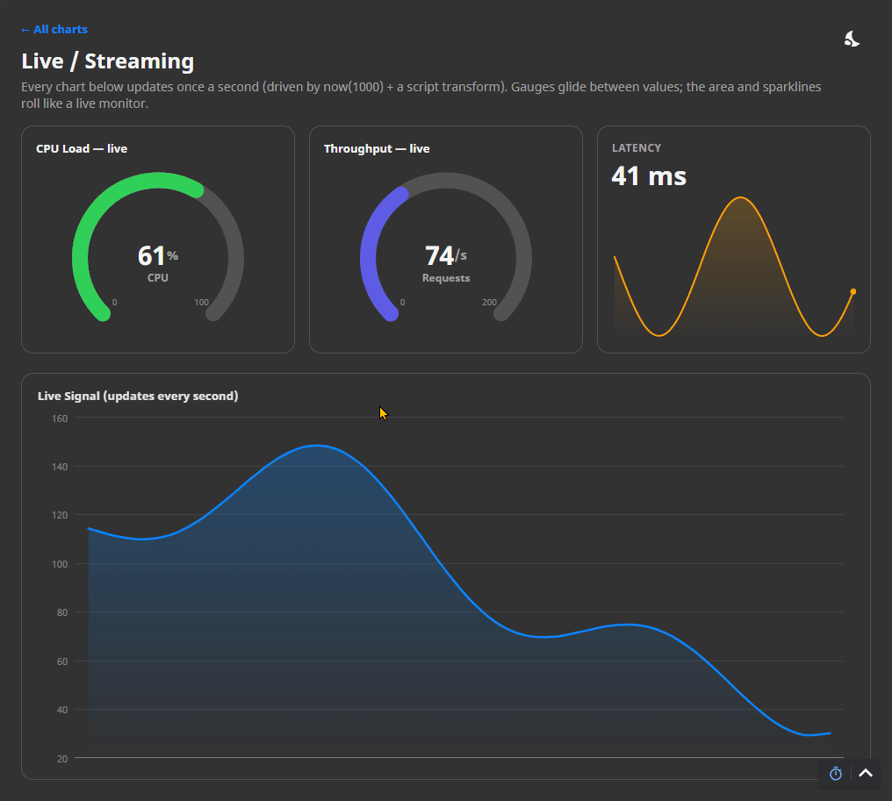

# Ectobox Charts

Beautiful, animated **chart components for Ignition 8.3 Perspective** — Eleven chart types, hand-drawn as crisp SVG (no third-party charting library), with
a curated Apple-style palette, automatic light/dark theming, buttery entrance animations, and
properties that are actually pleasant to bind in the Designer.



```python
# Every chart takes a dataset (from a named query, historian, etc.) or a plain array of objects.
# Drop one on a view, point its `data` prop at your query, and you're done.
```

## What's included

| Chart | Component id | Good for |
|---|---|---|
| **Line** | `ectobox.chart.line` | Multi-series trends (smooth / straight / step). |
| **Area** | `ectobox.chart.area` | Trends with gradient fill; volumes. |
| **Column** | `ectobox.chart.column` | Vertical grouped bars. |
| **Bar** | `ectobox.chart.bar` | Horizontal ranked bars. |
| **Scatter** | `ectobox.chart.scatter` | Numeric X/Y correlations. |
| **Bubble** | `ectobox.chart.bubble` | Three dimensions (X, Y, size). |
| **Pie** | `ectobox.chart.pie` | Proportions. |
| **Donut** | `ectobox.chart.donut` | Proportions with a count-up total in the hole. |
| **Gauge** | `ectobox.chart.gauge` | A single value with red/amber/green thresholds. |
| **Sparkline** | `ectobox.chart.sparkline` | Compact, axis-free trend lines for tiles/tables. |
| **Heatmap** | `ectobox.chart.heatmap` | Value-colored grids (schedules, density, correlation). |

All eleven appear in the Designer palette under the **Ectobox Charts** category.

## Why it's different
- **Hand-built SVG** — no ApexCharts/Chart.js/vendor bundle. Small, fast, and fully ours to shape.
- **Apple-style palette, always looks right** — a curated 12-color set applied automatically, so a
  multi-series chart looks good with zero configuration. Every color is a CSS variable you can override.
- **Automatic light/dark** — axes, gridlines, labels, and surfaces follow the gateway theme with no
  per-theme setup.
- **Animations that impress** — lines draw themselves in, columns/bars grow with a staggered cascade,
  pie/donut slices sweep in and explode on hover, gauges sweep + count up, scatter/bubble points pop in,
  heatmap cells wave in on a diagonal.
- **Overridable everywhere** — all styling is prefixed `.ecto-chart__*` CSS you can target from a
  project stylesheet.




## Install

1. Download **`Ectobox-Charts-8.3.modl`** from the [Releases](https://github.com/Ectobox/EctoboxIgnitionModules/releases/download/modules/Ectobox-Charts-8.3.modl) list.
2. Gateway → **Config → Modules → Install or Upgrade a Module** → pick the file (accept the Ectobox certificate on first install).
3. In the Designer, the chart components appear in the palette under **Ectobox Charts**.

## Quick start

1. Drop a chart (e.g. **Line Chart**) onto a view.
2. Bind its **`data`** prop to a dataset (named query, tag history, etc.) or set an array of objects.
3. In **`mapping`**, pick which column is the category/X axis and which columns are series — or leave it
   blank to auto-detect.

```python
# data as an array of objects (also what a dataset binding delivers):
[
  { "month": "Jan", "revenue": 42, "cost": 30 },
  { "month": "Feb", "revenue": 51, "cost": 33 }
]
# mapping: { "xColumn": "month", "series": [ {"column": "revenue"}, {"column": "cost"} ] }
# (leave mapping empty and it auto-uses the first non-numeric column as X and every numeric column as a series)
```

## Data & mapping

Every chart accepts an **Ignition dataset** *or* an **array of objects**, so it drops straight onto a
named-query binding or a scripted value. Each family maps columns a little differently:

| Family | Mapping props |
|---|---|
| Line / Area / Column / Bar | `mapping.xColumn` (category) + `mapping.series[]` (`column`, `name`, `color`). Empty = auto. |
| Scatter / Bubble | `mapping.xColumn`, `mapping.series[]` (Y), plus `sizeColumn` (bubble) and optional `labelColumn`. |
| Pie / Donut | `mapping.labelColumn` + `mapping.valueColumn`. |
| Heatmap | `mapping.xColumn`, `mapping.yColumn`, `mapping.valueColumn`. |
| Gauge | no data prop — bind the single **`value`** (plus `min`/`max`/`thresholds`). |
| Sparkline | an array of numbers, or `valueColumn` on an array of objects. |

## Theming & CSS

All styling ships in the module bundle. Axis/grid/label/surface colors follow Perspective's theme
variables (`--neutral-*`, `--container`) so **light/dark is automatic**. The series palette is exposed
as CSS custom properties you can override globally from a project stylesheet:

```css
:root {
  --ecto-chart-1: #0a84ff;   /* series 1 */
  --ecto-chart-2: #ff9f0a;   /* series 2 */
  /* ... up to --ecto-chart-12 ... */
}
```

Everything drawn is a prefixed class you can restyle: `.ecto-chart__line`, `.ecto-chart__area`,
`.ecto-chart__point`, `.ecto-chart__bar`, `.ecto-chart__dot`, `.ecto-chart__slice`,
`.ecto-chart__gauge-value`/`-track`, `.ecto-chart__cell`, plus the shared frame parts
`.ecto-chart__axis`, `.ecto-chart__gridline`, `.ecto-chart__axis-label`, `.ecto-chart__legend*`, and
`.ecto-chart__tooltip*`.

## Common properties

Beyond `data` + `mapping`, the cartesian charts share these (each chart also adds its own block, e.g.
`line.curve`, `bar.thickness`, `donut.innerRatio`, `gauge.thresholds`):

| Prop | Notes |
|---|---|
| `title` | Optional heading above the plot. |
| `categoryAxis` / `valueAxis` | `title`, `showLabels`, `showGridLines`; value axis adds `autoRange` + `min`/`max`. |
| `legend` | `enabled`, `position` (`top`/`bottom`/`left`/`right`). |
| `animation` | `enabled`, `durationMs`. |
| `palette` | Optional list of colors overriding the built-in palette for this chart. |

The Designer property editor shows every prop with inline descriptions, and defaults are chosen so a
freshly-bound chart looks good immediately.

## Live / streaming data

Because charts re-render on `data` change (and gauges *ease* to new values), a live dashboard needs no
special component — drive any chart from a Perspective **expression binding** on `now(pollRate)` with a
**script transform** that returns fresh data each tick:

```
Binding:   now(1000)                 # re-evaluates every second
Transform (script):
    import math
    t = value.getTime() / 1000.0     # now() returns a Date — use getTime() for millis
    return int(round(55 + 35 * math.sin(t / 5.0)))
```

Gauges glide between values; set `animation.enabled = false` on rolling line/area/sparklines so they
update like a clean live monitor.


