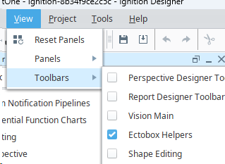
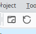
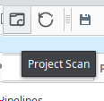
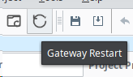
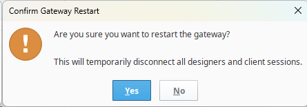
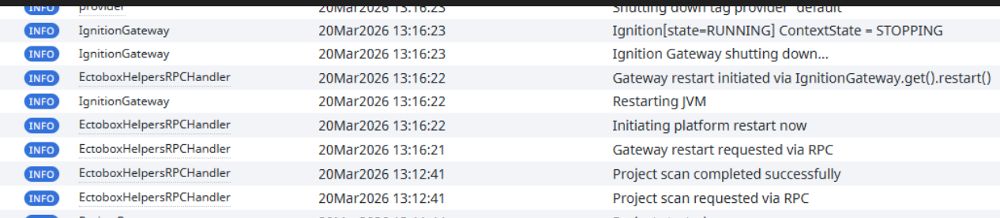

**⬇ [Download the latest module (v1.0.6)](https://github.com/Ectobox/EctoboxIgnitionModules/releases/download/modules/Ectobox-Helpers-8.3.modl)**

A catchall module that adds some things that IA forgot.
Currently we have 2 buttons.
Project Scan  -  Does a full project rescan in case you made changes in the file system and want them to show up 
Gateway Restart - Bounces the gateway executable gracefully

