# Ectobox Diagrams

**Mermaid-style diagrams for Ignition 8.3 Perspective** — flowcharts, state diagrams and sequence
diagrams written as plain text, laid out automatically, and rendered as crisp SVG. No charting library, no graph-layout
library: the parser, the layout engine and the renderer are all ours.

The part that makes it an Ignition component rather than a Mermaid port: **the diagram is live.** The
spec text is a bindable prop, so it can be *generated* from a dataset or from your tag tree; and
node/edge state is a second binding, so the same diagram shows what the plant is doing right now.

```
flowchart TD
    Start([Shift start]) --> Check{Line clear?}
    Check -->|No| Clear[Clear jam] --> Check
    Check -->|Yes| Fill[Filler] --> Cap[Capper] --> Ship([Dispatch])
```

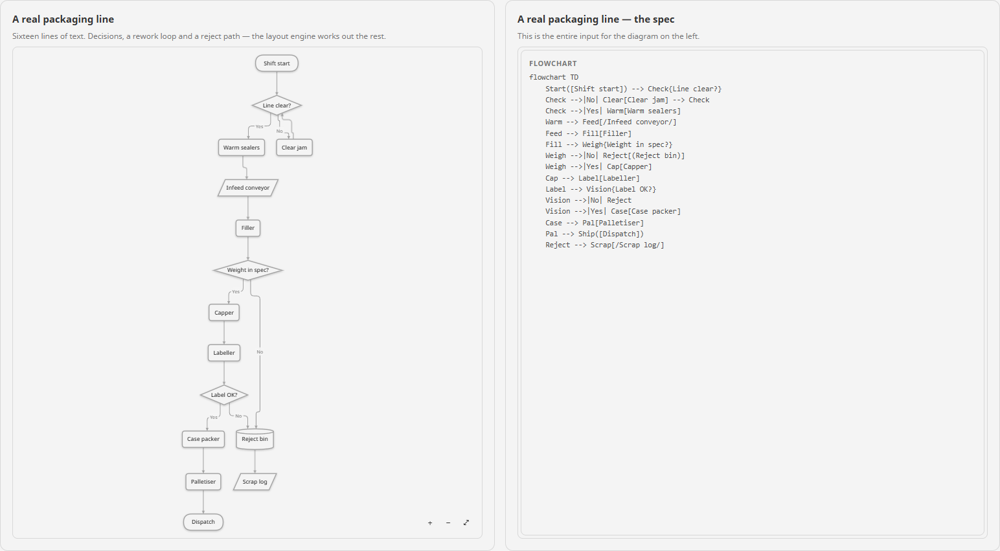

## What's included

| Component | Component id | Good for |
|---|---|---|
| **Flow Diagram** | `ectobox.diagram.flow` | Process flow, logic, routing, decisions, subgraphs. |
| **State Diagram** | `ectobox.diagram.state` | Machine modes, batch steps, CIP sequences, permit logic. |
| **Sequence Diagram** | `ectobox.diagram.sequence` | MES-to-PLC handshakes, recipe downloads, operator confirmations, interface logs. |

All three appear in the Designer palette under the **Ectobox Diagrams** category.

Plus a scripting namespace for generating specs from data:

| Function | What it does |
|---|---|
| `system.ectobox.diagrams.FlowFromDataset(edges, nodes, direction, defaultShape, connector)` | Builds a flowchart from an edge list (+ optional node list). Takes a dataset, a list of dicts, a list of lists or tuples, or the rows a Perspective binding hands you. |
| `system.ectobox.diagrams.StateFromTransitions(transitions, direction, initial, terminal)` | Builds a state diagram from a from/to/event transition table. |
| `system.ectobox.diagrams.SequenceFromEvents(events, participants, autonumber, title)` | Builds a sequence diagram from a message log: sender, receiver, message, and optionally the kind of message. |
| `system.ectobox.diagrams.FromUdtStructure(tagPath, direction, style, maxDepth, includeTags, showTypes, showValues)` | Walks the live tag tree and renders the equipment hierarchy. |
| `system.ectobox.diagrams.TagNodeId(rootPath, tagPath)` | The node id `FromUdtStructure` gives a tag, for keying `nodeStates` by tag. |
| `system.ectobox.diagrams.Escape(label)` / `SafeId(text)` | Make arbitrary text safe to drop into a spec. |

## Why it's different
- **The diagram is live.** `nodeStates` / `edgeStates` recolor, relabel, badge, pulse and animate the
  diagram from tags without the spec text changing. A State Diagram with `activeState` bound to one tag
  shows the mode the machine is actually in; a Sequence Diagram with `activeStep` bound to a step tag
  shows which message of a handshake is under way.
- **Generated, not drawn.** Point `FromUdtStructure` at a tag folder and the equipment hierarchy draws
  itself. Feed `FlowFromDataset` a named query and the routing diagram comes from your data.
- **Nothing to lay out.** A layered (Sugiyama-style) engine handles ranking, crossing reduction, chain
  straightening and edge routing. You write what connects to what; it decides where things go.
- **No third-party bundle.** No `mermaid`, no `dagre`, no charting library — same as the Charts module.
  Small, fast, and fully ours to shape.
- **Automatic light/dark.** Nodes, edges, labels and group boxes follow the gateway theme with no
  per-theme setup, and every color is a CSS variable you can override.
- **Errors you can act on.** A spec that doesn't parse shows the offending line numbers and messages in
  the component — never a blank box that looks like a broken binding.

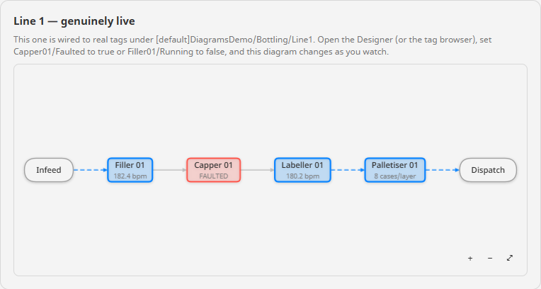
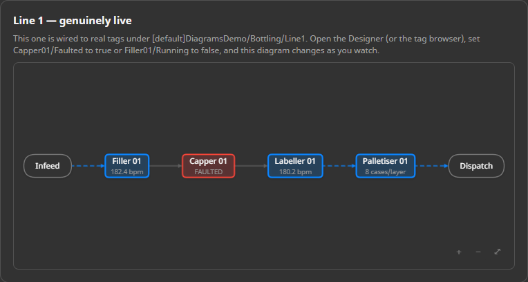

## Install

1. Download **`Ectobox-Diagrams-8.3.modl`** from the [Releases](https://github.com/Ectobox/EctoboxIgnitionModules/releases/download/modules/Ectobox-Diagrams-8.3.modl) list.
2. Gateway → **Config → Modules → Install or Upgrade a Module** → pick the file (accept the Ectobox certificate on first install).
3. In the Designer, the diagram components appear in the palette under **Ectobox Diagrams**.

## Quick start

1. Drop a **Flow Diagram** onto a view. It ships with a working example in its `text` prop.
2. Edit `text` — that's the whole diagram.
3. To make it live, bind `nodeStates` to a script transform returning a list of
   `{"id": ..., "state": ...}` objects.

```python
# nodeStates: one entry per node you want to say something about.
[
  {"id": "Fill",   "state": "running", "value": "180 bpm"},
  {"id": "Cap",    "state": "bad", "pulse": True, "value": "FAULT 3121"},
  {"id": "Reject", "state": "warn", "badge": "17"}
]
```

Semantic states — `active`, `good`, `warn`, `bad`, `muted`, `running`, `done` — pick themed colors for
you, so a live diagram looks right without choosing colors per node. `color` overrides them when you
need something specific.

## Supported syntax

Mermaid's flowchart, state-diagram and sequence-diagram syntax, drawn the way Mermaid means it. A spec pasted from the
Mermaid docs works; the little that has nothing to draw here is reported in `parse.warnings` rather than
silently mangled.

**`flowchart TD | BT | LR | RL`** (also `graph`, and `flowchart-elk`, drawn with the built-in layout)

- Node shapes: `[rect]`, `(round)`, `([stadium])`, `[[subroutine]]`, `[(cylinder)]`, `((circle))`,
  `(((double circle)))`, `{rhombus}`, `{{hexagon}}`, `[/parallelogram/]`, `[/trapezoid\]`, `>asymmetric]`
- Mermaid 11's named shapes: `Check@{ shape: diam, label: "In spec?" }` — `rect`, `rounded`, `stadium`,
  `subproc`, `cyl`, `circle`, `dbl-circ`, `diam`, `hex`, `lean-r`, `lean-l`, `trap-b`, `trap-t`, `odd`,
  `sm-circ`, `fr-circ`, `fork`, and their long-form aliases. Any other named shape is drawn as a rectangle,
  with a warning.
- Edges: `-->` arrow, `---` line, `-.->` dotted, `==>` thick, `--x` cross, `--o` circle, `<-->`
  bidirectional, `o--o` / `x--x` both ends, `~~~` invisible. Extra dashes (`--->`) push the nodes further
  apart.
- Edge labels: `A -->|yes| B`, `A -- yes --> B`, `A -. rework .-> B`, `A == main ==> B`
- Edge ids and animation: `A e1@--> B`, then `e1@{ animate: true }`. The id is the edge's own id, so
  `edgeStates` can key on it.
- `linkStyle 0,2 stroke:#f00,stroke-width:3px` by edge number (counting from 0, in spec order), and
  `linkStyle default …` for every edge. `stroke`, `stroke-width`, `stroke-dasharray`, `opacity`, and
  `color` for the label. Live `edgeStates` colours still win.
- `click` — `click A "/units/filler" "Tooltip" _blank`, `click A href "…"`, `click A callback "Tooltip"`,
  `click A call openUnit("A", 2)`. The tooltip shows on hover; see **Events** for what a click does.
- `subgraph Name [Title]` … `end`, including nesting
- Edges to a subgraph itself (`intake --> process`) land on its box
- `direction LR` inside a subgraph lays that subgraph out its own way — when nothing inside it links to
  the outside, which is Mermaid's own rule
- `classDef` / `class` / `:::class` / `style`, including `classDef default` for every node
- `A & B --> C & D` (cross product)
- Markdown strings (`` "`**Filler** 01`" ``): the markers are dropped and line breaks kept. Entity codes
  (`#gt;`, `&deg;`, `#35;`) and `<br/>` are decoded.
- `;` between statements, `%%` comments, and `%%{init: …}%%` directives (ignored)
- `accTitle: …` / `accDescr: …` (and the `accDescr { … }` block) become the drawing's accessible name and
  description, for screen readers
- Icons (`fa:fa-industry`) aren't drawn; the label text is kept, with a warning

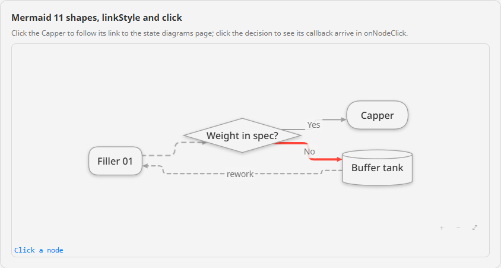

**`stateDiagram-v2`**

- Transitions with `A --> B : trigger`, and chains `A --> B --> C : trigger`
- `[*]` start and end markers (per scope)
- `state Name { … }` composite states, nested to any depth, `state "Long name" as X` aliases. A
  composite is a state in its own right: `Idle --> Producing` lands on the Producing box and
  `Producing --> Faulted` leaves it, and a transition from outside to a sub-state enters the box and
  runs to that sub-state.
- `direction LR` inside a composite lays out just that composite's contents that way
- Concurrent regions: `--` inside a composite splits it into regions that run at the same time, drawn
  side by side with a dashed divider, each with its own `[*]` markers
- `<<fork>>` / `<<join>>` bars that stretch across the branches they split or merge, and `<<choice>>`
- Notes beside their state: `note left of X : text`, or `note right of X` with the text on the following
  lines up to `end note`. Floating notes: `note "text" as N1`
- `X : description` second lines
- `classDef` / `class` / `:::class` (on declarations and transitions) / `style`
- `click`, `accTitle` / `accDescr`, `direction LR`, `%%` comments

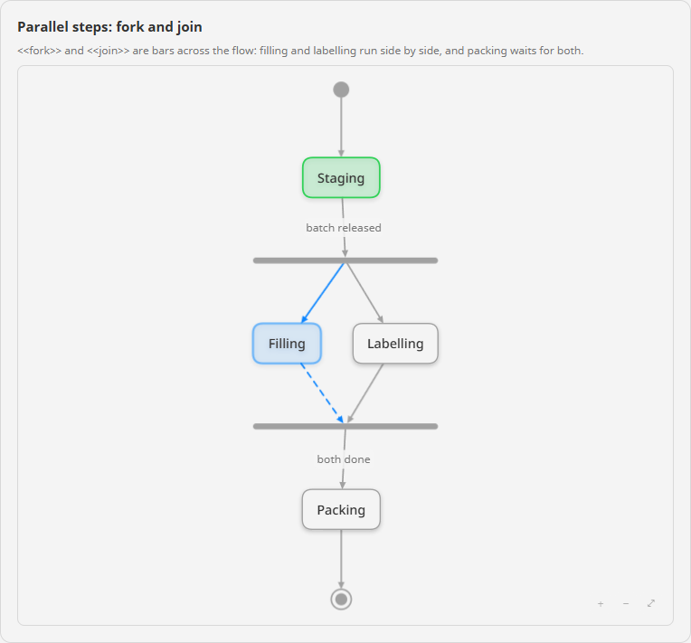
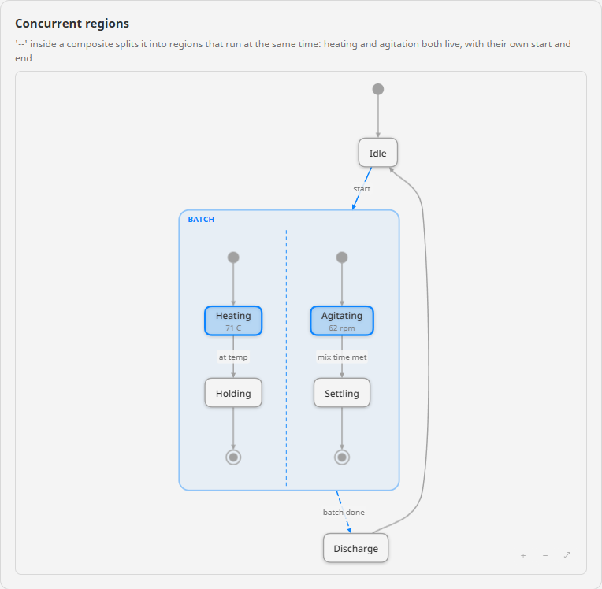

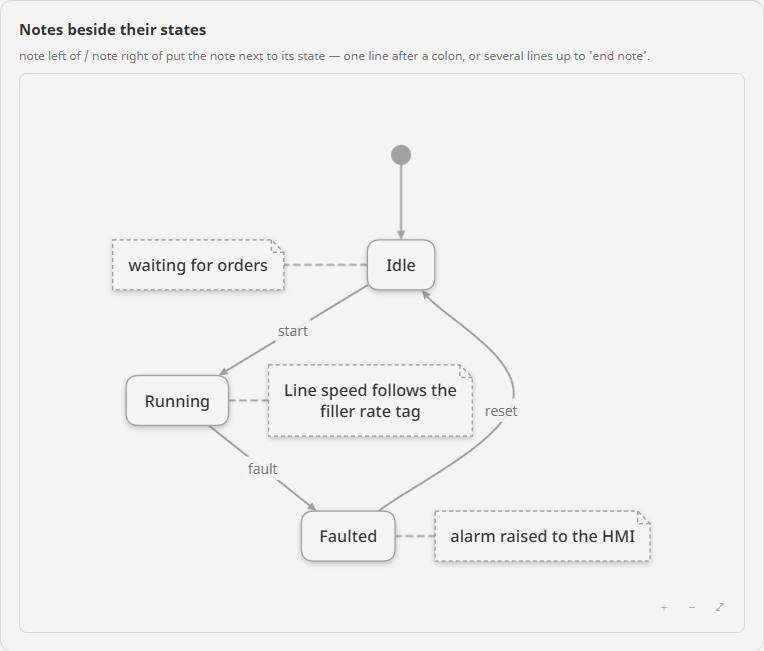

**`sequenceDiagram`**

- `participant X`, `participant X as Line 1 PLC`, `actor Op as Operator`, and Mermaid 11's participant
  types: `participant Hist@{ "type": "database" }` — `database`, `queue`, `collections`, `boundary`,
  `control`, `entity`. Participants run left to right in the order they are declared or first used, and
  a name may hold spaces and hyphens (`PLC-01`, `Line 1 HMI`).
- Messages, with the text after a colon: `->>` call, `-->>` reply (dashed), `->` / `-->` line with no
  head, `-x` / `--x` failed or lost (a cross), `-)` / `--)` asynchronous (an open head), `<<->>` /
  `<<-->>` both ways. A message from a participant to itself loops back to its own lifeline.
- Activations: `activate X` / `deactivate X`, or the shorthand `A->>+B` (B activates) and `B-->>-A` (B
  deactivates). Nested activations stack.
- Notes: `Note left of X: …`, `Note right of X: …`, `Note over X: …`, and `Note over A,B: …` across two
- Frames: `loop`, `alt` … `else`, `opt`, `par` … `and`, `critical` … `option`, `break`, each with its
  condition and closed by `end`, nested to any depth. `rect rgb(…)` shades the messages inside it.
- `box Aqua Line 1` … `end` groups participants under a label and a colour
- `create participant X` starts X's lifeline at the message that creates it; `destroy X` ends it, with a
  cross, at the next message X takes part in
- `autonumber` numbers the messages; `autonumber 10 10` starts at 10 and counts in tens, and
  `autonumber off` stops. That number is the message's step, which is what `activeStep` matches.
- `title …`, `link X: Panel @ /line1` (a click on the participant follows it), `accTitle` / `accDescr`,
  `%%` comments, `<br/>` and entity codes in message text

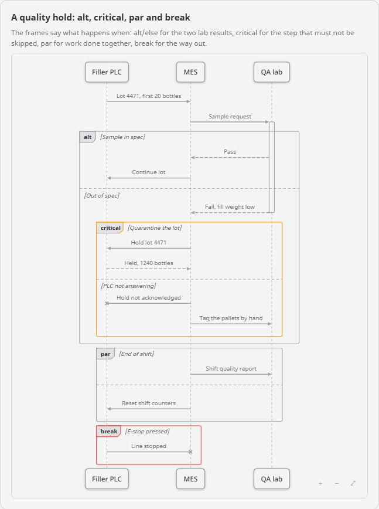
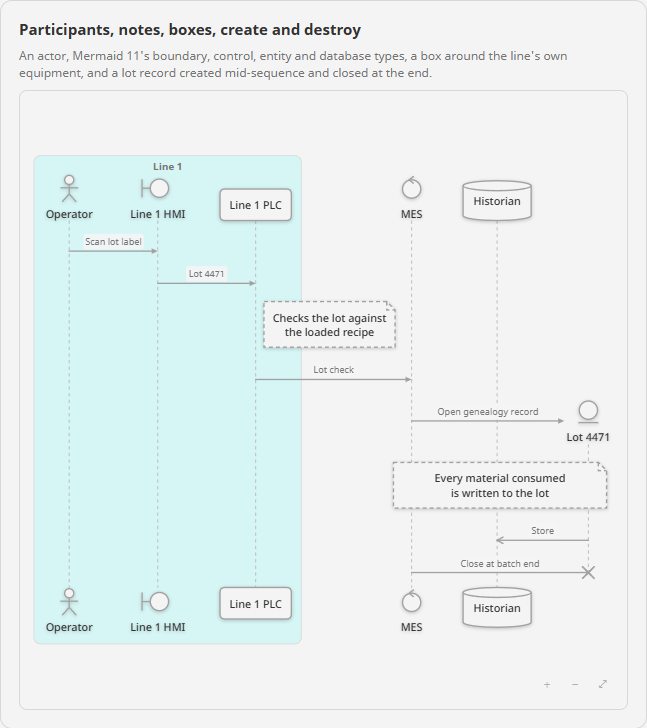

A spec for another diagram kind (`gantt`, class, ER and the rest) is refused with an error in
`parse.errors` that names the kind, rather than drawn as a flowchart of its keywords. A spec of one of
the three kinds dropped into another kind's component still draws, with a note saying which component
suits it.

## Data & bindings

| Want | Do |
|---|---|
| A diagram from a query | Bind `text` to a script transform calling `FlowFromDataset(...)`. |
| A diagram of your plant | Bind `text` to `FromUdtStructure('[default]Packaging/Line1', ...)`. |
| A state model from a table | Bind `text` to `StateFromTransitions(...)`. |
| Live equipment status | Bind `nodeStates` to a script transform over your tags. |
| Show the current mode | Bind the State Diagram's `activeState` to one string tag. |
| A sequence from a message log | Bind a Sequence Diagram's `text` to `SequenceFromEvents(...)`. |
| Show where a handshake is | Bind the Sequence Diagram's `activeStep` to the handshake's step tag. |
| Drill into a unit | Use the `onNodeClick` event — `event.id` is the node id from the spec. |

Column names are matched loosely, so a query returning `source` / `target` / `label` needs no
reshaping: `from`/`source`/`src`/`parent` and `to`/`target`/`dest`/`child` are all recognized.

`FromUdtStructure` reads the tag tree, so it runs in gateway/Perspective scope (a binding, a gateway
event, a project script called from either) — not in the Designer's script console. Every other function
works in any scope.

## Common properties

All three components share these (the State and Sequence Diagrams add their own blocks below):

| Prop | Notes |
|---|---|
| `text` | The diagram spec. Bind it to generate the diagram from data. |
| `direction` | `TD`/`TB`/`BT`/`LR`/`RL` override for the direction in the spec. Blank = use the spec (or `TD`). |
| `nodeStates[]` | Live per-node state: `id`, `state`, `color`, `textColor`, `label`, `value` (second line), `tooltip`, `pulse`, `badge`. |
| `edgeStates[]` | Live per-edge state, matched by `id` or by `from`/`to`: `state`, `color`, `label`, `width` (0 = default), `animated`. |
| `layout` | `nodeSpacing`, `rankSpacing`, `edgeStyle` (`orthogonal`/`curved`/`straight`), `cornerRadius`, `crossingPasses`, `straightenChains`. |
| `nodeStyle` | `minWidth`, `paddingX`, `paddingY`, `cornerRadius`, `fontSize`, `maxLabelWidth`, `shadow`. |
| `edgeStyle` | `width`, `arrowSize`, `fontSize`, `labelBackground`. |
| `interaction` | `panZoom`, `wheelZoom`, `fitToView`, `maxAutoZoom`, `minAutoZoom`, `showControls`, `clickableNodes`, `followLinks`. `wheelZoom` is `"ctrl"` by default: the wheel zooms only with Ctrl or ⌘ held (or a trackpad pinch), so a diagram on a scrolling page never traps the page's scroll. `"always"` suits a diagram that fills its page; `"off"` leaves zoom to the buttons. |
| `animation` | `enabled`, `durationMs`. |
| `maxNodes` | Safety cap, default **400**. |
| `title` | Optional heading above the diagram. |

The two components start from different layout defaults: the Flow Diagram routes edges `orthogonal`
with 6 px node corners, while the State Diagram routes transitions `curved` with 10 px corners and a
little more spacing, which is how state models conventionally read.

The Designer property editor shows every prop with inline descriptions, and defaults are chosen so a
freshly-dropped diagram looks right immediately.

### State Diagram extras

| Prop | Notes |
|---|---|
| `activeState` | The state the machine is in *right now*. Bind it to one tag and that state highlights and pulses. It can name a composite state: the whole box lights up, with its transitions in and out. |
| `visitedStates` | State ids already passed through, drawn as completed — a breadcrumb trail through a batch or CIP sequence. |
| `stateOptions.highlightActivePath` | Also light up the transitions into and out of `activeState` (default on). |
| `stateOptions.showStartEnd` | Draw the `[*]` start (filled dot) and end (ringed dot) markers. Off hides them and the transitions to and from them (default on). |
| `stateOptions.compositePadding` | Space in px between a composite state's border and what's inside it (default 18). |
| `stateOptions.dimInactive` | Fade every state except the active one — reads well on a large model on a big screen. |

`activeState` covers the simple "where am I now" case. Use `nodeStates` when several states need
coloring at once — one active plus two alarmed, say.

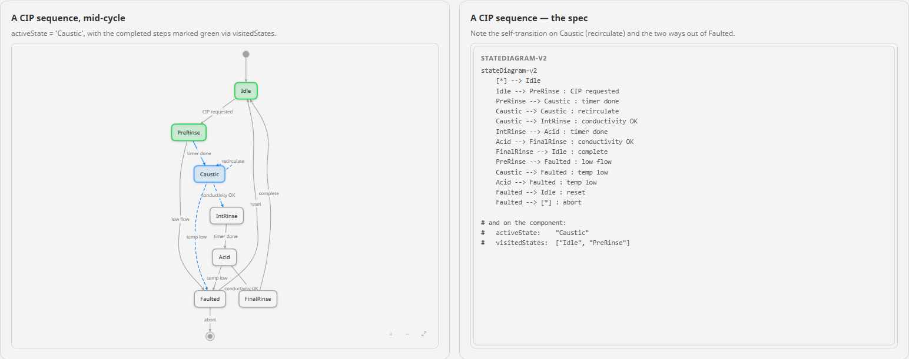

### Sequence Diagram extras

A sequence diagram has no direction to set and no graph to lay out, so `direction`, `maxNodes`, the
edge routing options and `layout.crossingPasses` don't apply to it. `layout.nodeSpacing` is the least
gap between two participants (columns also widen to fit the messages between them), and
`layout.rankSpacing` the gap from one message to the next.

| Prop | Notes |
|---|---|
| `activeStep` | The step the sequence is on *right now*. Bind it to the handshake's step tag: that message lights up and animates, the ones before it turn green, and the two participants in it are highlighted. A step is the number `autonumber` shows — 1, 2, 3 in order, or 10, 20, 30 after `autonumber 10 10` — so a PLC step register binds with no translation. `0` = no active step. |
| `nodeStates[]` | Keyed by participant id. A participant's state also tints its lifeline and activation bars, so a faulted PLC reads as faulted all the way down. |
| `edgeStates[]` | `id` targets one message — `m1` is the first message in the spec, `m2` the second — and `from`/`to` every message between two participants. An entry here wins over what `activeStep` draws. |
| `sequenceOptions.showNumbers` | Number every message, as if the spec began with `autonumber` (default off). |
| `sequenceOptions.markCompleted` | Draw the messages before `activeStep` as done (default on). |
| `sequenceOptions.highlightParticipants` | Highlight the two participants in the `activeStep` message (default on). |
| `sequenceOptions.mirrorActors` | Repeat the participants along the bottom (default on). |

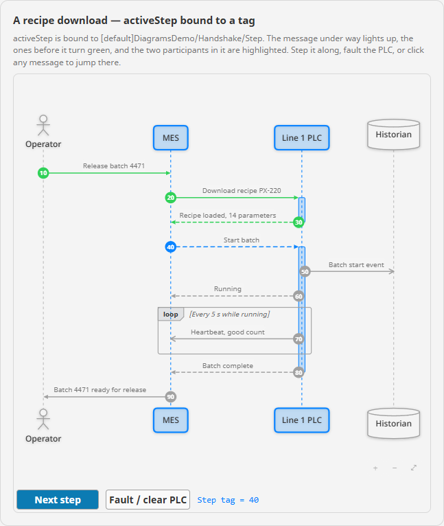

## Events

| Event | Payload |
|---|---|
| `onNodeClick` (Flow Diagram) | `id`, `label`, `shape`, `classes`, `group`, and `state` — the node's current state from `nodeStates`, or `''` when it has none. A click on a subgraph's box fires it too, with `shape` `'group'`. |
| `onNodeClick` from a `click` line (both) | Adds `link` and `linkTarget`, or `callback` and `callbackArgs` (the arguments of `click X call fn(…)`, as text). With `interaction.followLinks` on (the default), a project page link (`/units/filler`) navigates in the session — the page is being replaced, so onNodeClick doesn't fire — and a full URL opens in a new tab and fires onNodeClick. Turn `followLinks` off to handle every link yourself. |
| `onNodeClick` (State Diagram) | `id`, `label`, `classes`, `group`, `active` (true when it's the `activeState`), and `state` — the state as drawn: its `nodeStates` entry, else `active` / `done` from `activeState` / `visitedStates`, else `''`. A click on a composite state's box fires it too, with that composite's `id`. |
| `onNodeClick` (Sequence Diagram) | A click on a participant: `id`, `label`, `shape`, `group` (the `box` it sits in: `__box1`, `__box2` … in spec order, or `''`), and `state` — `active` while it takes part in the `activeStep` message, else its `nodeStates` entry, else `''`. A participant with a `link` line also carries `link`. |
| `onEdgeClick` (Flow and State) | `id`, `from`, `to`, `label`. |
| `onEdgeClick` (Sequence Diagram) | A click on a message: `id` (`m1`, `m2` …), `from`, `to`, `label`, `step` (the number `activeStep` matches), `active`, and `state` (`active`, `done`, or from `edgeStates`). Writing `event.step` to the step tag makes a click jump the handshake there. |

`event.id` is the node id from the spec, so it matches the ids you use in `nodeStates`, and
`event.state` tells the handler what the operator was looking at when they clicked — it can decide what
the click means without re-reading every tag first. This one tells the operator about the machine they
clicked, using [Ectobox Alerts](Alerts.md) — drop one **Alert Host** on the page and the message box and
toasts appear over it:

```python
# onNodeClick on a packaging line Flow Diagram, on a page with an Ectobox Alerts Alert Host
machinePath = '[default]Packaging/Line1/{0}'.format(event.id)
if event.state == 'bad':
    faultCode = system.tag.readBlocking(['{0}/FaultCode'.format(machinePath)])[0].value
    system.ectobox.alerts.ShowMessageBox(
        '{0} is faulted'.format(event.label),
        'Fault {0}. Clear it at the machine, then reset it from its panel.'.format(faultCode),
        'error', ['OK'], pageId=self.page.id)
else:
    rate = system.tag.readBlocking(['{0}/Rate'.format(machinePath)])[0].value
    system.ectobox.alerts.ShowToast(
        event.label, 'Running at {0} per minute.'.format(rate), 'success', pageId=self.page.id)
```

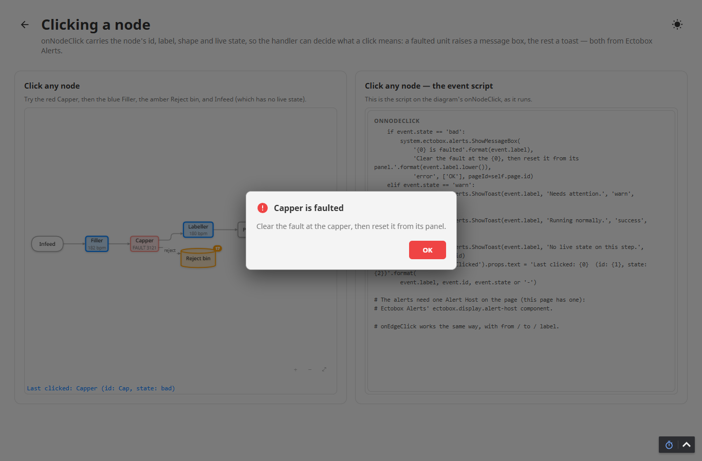

## Output props

Read-only, written back by the component — check these when a diagram renders unexpectedly:

| Property | Contents |
|---|---|
| `parse` | `ok`, `errors[]` (each with a line number and message), `warnings[]` (unsupported constructs skipped, node cap hit). |
| `stats` | `nodes`, `edges`, `ranks`, `width`, `height` — the laid-out size, handy for sizing a container. A Sequence Diagram reports `participants`, `messages`, `width`, `height`. |

Writes only happen when the result actually changes, so they can't loop.

## Scripting: `system.ectobox.diagrams.*`

Every function returns spec **text** — the string the component's `text` prop takes — so they drop
straight into a binding's script transform. Registered in gateway *and* Designer scope, so you get
autocomplete while you write. Arguments may be given positionally or by keyword.

### A routing diagram from the database

`FlowFromDataset` takes an edge list and, optionally, a node list that sets each node's label, shape,
class and group (a group wraps its nodes in a subgraph box). Nodes that appear only in the edge list
are created automatically, so the edge list on its own is enough.

```python
# Project library script: Diagrams
def GetLineRouting(lineId):
    edges = system.db.runPrepQuery("""
        SELECT src.Name AS source, dst.Name AS target, r.Product AS label
        FROM EquipmentRoute r
        JOIN Equipment src ON src.ID = r.FromEquipmentID
        JOIN Equipment dst ON dst.ID = r.ToEquipmentID
        WHERE r.LineID = ?
        ORDER BY r.ID
    """, [lineId])

    nodes = system.db.runPrepQuery("""
        SELECT e.Name AS id,
               e.Description AS label,
               CASE WHEN e.EquipmentType = 'Tank' THEN 'cylinder' ELSE 'rect' END AS shape,
               e.Area AS area
        FROM Equipment e
        WHERE e.LineID = ?
        ORDER BY e.ID
    """, [lineId])

    return system.ectobox.diagrams.FlowFromDataset(edges, nodes, direction='LR')
```

Bind the Flow Diagram's `text` to a transform that calls `Diagrams.GetLineRouting(value)` on the view's
line ID, and the diagram follows the routing table.

| Argument | Notes |
|---|---|
| `edges` | Required. Columns (loosely matched): `from`/`source`/`src`/`parent`/`start`, `to`/`target`/`dest`/`destination`/`child`/`end`, optional `label`/`text`/`title`/`name`/`description`, optional `connector`/`edgeStyle`/`lineStyle`/`arrow`. |
| `nodes` | Optional. `id`/`node`/`key`/`name`, `label`/`text`/`title`/`description`, `shape`/`kind`/`type`, `class`/`cssClass`/`style`/`category`, `group`/`subgraph`/`area`/`section`. |
| `direction` | `"TD"` (default), `"LR"`, `"BT"`, `"RL"`. |
| `defaultShape` | For nodes that don't set one — `rect` (default), `round`, `stadium`, `subroutine`, `cylinder`, `circle`, `rhombus`, `hexagon`, `parallelogram`, `trapezoid`. Friendly aliases work too: `box`, `decision`, `terminal`, `database`, `io`. |
| `connector` | For edges that don't set one — `"-->"` (default), `"---"`, `"-.->"`, `"==>"`. |

### Read this bit: generated ids go through `SafeId`

Names from your data become node ids via `SafeId` — letters, digits and underscores only, never starting
with a digit — so `"Filler #2"` becomes `Filler_2`. The original name stays as the label. When you build
`nodeStates` for a generated diagram, run the same names through `SafeId` so the ids line up:

```python
# Project library script: Diagrams
STATE_BY_CODE = {0: 'muted', 1: 'running', 2: 'warn', 3: 'bad'}

def GetLineStates(linePath, machineNames):
    paths = []
    for machineName in machineNames:
        paths.append('{0}/{1}/StateCode'.format(linePath, machineName))
        paths.append('{0}/{1}/Rate'.format(linePath, machineName))
    values = system.tag.readBlocking(paths)

    nodeStates = []
    for i, machineName in enumerate(machineNames):
        stateCode = values[i * 2].value
        rate = values[i * 2 + 1].value
        nodeStates.append({
            'id':    system.ectobox.diagrams.SafeId(machineName),
            'state': STATE_BY_CODE.get(stateCode, 'default'),
            'value': '{0:.0f} bpm'.format(rate or 0),
            'pulse': stateCode == 3,
        })
    return nodeStates
```

`Escape(label)` is the companion for hand-assembled specs: it quotes text containing characters the
spec syntax would otherwise eat (brackets, braces, pipes, quotes) and converts newlines to line breaks.

### A state model from a transition table

`StateFromTransitions` takes the shape a state model usually already has: from state, to state, and the
event that causes it. `initial` adds the `[*]` start marker; `terminal` (a list of state names, or rows
with a `state` column) gives each of those states an arrow out to the end marker.

```python
# Project library script: Diagrams
def GetMachineStateModel(machineTypeId):
    transitions = system.db.runPrepQuery("""
        SELECT t.FromState AS source, t.ToState AS target, t.TriggerEvent AS event
        FROM StateTransition t
        WHERE t.MachineTypeID = ?
        ORDER BY t.ID
    """, [machineTypeId])

    return system.ectobox.diagrams.StateFromTransitions(
        transitions,
        direction='LR',
        initial='Idle',
        terminal=['Aborted']
    )
```

Then bind the State Diagram's `activeState` to the capper's mode tag (for example
`[default]Packaging/Line1/Capper/Mode`) and the model shows where the machine actually is. As with flow
diagrams, state names that aren't already valid ids go through `SafeId` — `"Clearing Jam"` becomes
`Clearing_Jam` with a `state "Clearing Jam" as Clearing_Jam` alias — so bind `activeState` to that id.

| Argument | Notes |
|---|---|
| `transitions` | Required. `from`/`source`/`src`/`parent`, `to`/`target`/`dest`/`child`, optional `label`/`text`/`name`/`event`/`trigger`. |
| `direction` | `"TD"`, `"LR"`, `"BT"`, `"RL"`. Blank (default) lets the component decide. |
| `initial` | The starting state. Blank (default) = no start marker. |
| `terminal` | States that end the sequence. `None` (default) = no end markers. |

### A sequence from a message log

`SequenceFromEvents` takes the shape an interface log or handshake audit table already has: who sent a
message, who received it, and what it said, in order. The optional `kind` (or `arrow`) column picks the
arrow: a Mermaid operator as written, or a word — `call` (the default), `reply` / `return` / `response`
/ `ack` (dashed), `async` / `event` / `publish` (open head), `fail` / `error` / `lost` / `timeout` (a
cross).

```python
# Project library script: Diagrams
def GetBatchMessages(batchId):
    log = system.db.runPrepQuery('''
        SELECT m.Sender AS sender, m.Receiver AS receiver, m.MessageText AS message, m.Kind AS kind
        FROM InterfaceMessage m
        WHERE m.BatchID = ?
        ORDER BY m.LoggedAt
    ''', [batchId])

    return system.ectobox.diagrams.SequenceFromEvents(
        log,
        participants=[{'name': 'Operator', 'type': 'actor'}, 'MES', 'Line 1 PLC',
                      {'name': 'Historian', 'type': 'database'}],
        autonumber=True
    )
```

Bind a Sequence Diagram's `text` to a transform that calls `Diagrams.GetBatchMessages(value)` on the
view's batch ID, and the diagram shows exactly what passed between the systems for that batch.

| Argument | Notes |
|---|---|
| `events` | Required. Columns (loosely matched): `from`/`sender`/`source`/`src`/`caller`, `to`/`receiver`/`target`/`dest`/`callee`, `message`/`label`/`text`/`event`/`description`, optional `arrow`/`kind`/`type`. |
| `participants` | Optional: the column order, including participants that send nothing. A list of names, or rows with `name`/`id`, optional `label`, and optional `type` (`actor`, `database`, `queue`, `boundary`, `control`, `entity`, `collections`). `None` (default) = order of first appearance. |
| `autonumber` | Number the messages 1, 2, 3 — the numbers `activeStep` matches. Default `False`. |
| `title` | A title line for the diagram. Default none. |

Names that aren't already valid ids go through `SafeId` with the name kept as the label: `Line 1 PLC`
becomes `participant Line_1_PLC as Line 1 PLC`, so key `nodeStates` by `Line_1_PLC`.

### A diagram of your tag tree

`FromUdtStructure` walks the live tag tree under a path — UDT instances labelled with their type,
folders as containers, optionally the atomic tags and their current values. Point it at an area folder
and the equipment hierarchy draws itself.

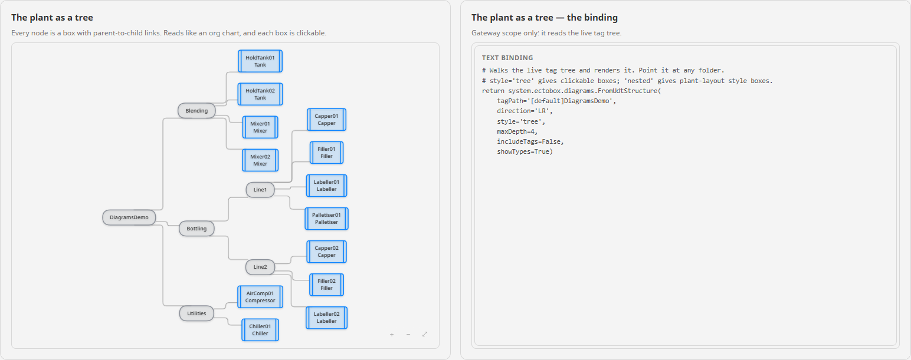

```python
# Binding on a Flow Diagram's text prop: expression binding on the view's area path, then this transform
def transform(self, value, quality, timestamp):
    return system.ectobox.diagrams.FromUdtStructure(
        tagPath=value,          # e.g. '[default]Packaging/Line1'
        direction='LR',
        style='nested',
        maxDepth=2
    )
```

| Argument | Notes |
|---|---|
| `tagPath` | The path to browse, e.g. `"[default]Packaging/Line1"`. Blank browses the provider roots. |
| `direction` | `"LR"` (default — best for hierarchies), `"TD"`, `"BT"`, `"RL"`. |
| `style` | `"tree"` (default): a box per node with parent-to-child edges, reads like an org chart. `"nested"`: folders and UDT instances become subgraph boxes around their children, reads like a plant layout — better when the tree is shallow and wide. |
| `maxDepth` | Levels below the path to descend, default `3`. Keep it small on a big provider. |
| `includeTags` | Include atomic tags, not just folders and UDT instances. Default `False`. |
| `showTypes` | Show a UDT instance's type name on a second line. Default `True`. |
| `showValues` | Read and show each tag's current value. Implies `includeTags`. Default `False`. |

Each node's id is its tag path below `tagPath`, segments joined by a double underscore: browsing
`[default]Packaging` gives `Line1__Filler01` for `[default]Packaging/Line1/Filler01`. It is the same on
every run, so it can key `nodeStates` — `TagNodeId(rootPath, tagPath)` returns it for any tag — and for
tag names made of letters, digits and underscores `event.id.replace('__', '/')` turns a clicked node
back into its path.

```python
# nodeStates binding on the same Flow Diagram: each unit red while its Faulted tag is set
def transform(self, value, quality, timestamp):
    rootPath = '[default]Packaging'
    unitPaths = ['{0}/Line1/{1}'.format(rootPath, name) for name in ('Filler01', 'Capper01', 'Labeller01')]
    faults = system.tag.readBlocking(['{0}/Faulted'.format(p) for p in unitPaths])
    states = []
    for unitPath, fault in zip(unitPaths, faults):
        states.append({
            'id': system.ectobox.diagrams.TagNodeId(rootPath, unitPath),
            'state': 'bad' if fault.value else 'running',
        })
    return states
```

## Theming & CSS

All styling ships in the module bundle, and the neutral colors follow Perspective's theme variables
(`--container`, `--neutral-*`) so **light/dark is automatic**. The diagram's own colors are CSS custom
properties you can override from a project stylesheet:

```css
:root {
  --ecto-diagram-node-fill:   #f5f7fa;
  --ecto-diagram-node-stroke: #8e8e93;
  --ecto-diagram-edge-stroke: #8e8e93;
}
```

The full set: `--ecto-diagram-node-fill`, `-node-stroke`, `-text`, `-sub-text`, `-edge-stroke`,
`-edge-muted`, `-group-fill`, `-group-stroke`, `-group-label`, `-plate` (the backing behind edge
labels), and the `-control-bg` / `-control-border` of the zoom buttons. Sequence diagrams add
`-lifeline`, `-activation-fill`, `-frame-stroke`, `-frame-tab`, `-frame-text`, `-seq-box-fill` and
`-seq-rect-fill`.

The semantic state colors are variables too, so one override recolors a state on every node and edge:

| Variable | State | Default |
|---|---|---|
| `--ecto-diagram-active` | `active` | `#0a84ff` |
| `--ecto-diagram-running` | `running` | follows `--ecto-diagram-active` |
| `--ecto-diagram-good` | `good` | `#30d158` |
| `--ecto-diagram-done` | `done` | follows `--ecto-diagram-good` |
| `--ecto-diagram-warn-state` | `warn` | `#ff9f0a` |
| `--ecto-diagram-bad` | `bad` | `#ff453a` |

```css
/* Plant standard: faults are magenta, not red */
:root {
  --ecto-diagram-bad: #d500f9;
}
```

A state's fill is its color at low opacity, so it reads the same on light and dark backgrounds. To use
a different color on one particular node or edge, set `color` in its `nodeStates` / `edgeStates` entry.

Everything drawn is a prefixed class you can restyle: `.ecto-diagram__node`, `.ecto-diagram__node-shape`,
`.ecto-diagram__node-label`, `.ecto-diagram__node-sub`, `.ecto-diagram__node-badge`,
`.ecto-diagram__edge`, `.ecto-diagram__edge-line`, `.ecto-diagram__edge-arrow`,
`.ecto-diagram__edge-label`, `.ecto-diagram__group-box`, `.ecto-diagram__group-label`,
`.ecto-diagram__title`, and `.ecto-diagram__controls`.

## Performance

`maxNodes` (default **400**) caps how much is drawn; going over it reports the truncation in
`parse.warnings` rather than locking up the browser. `layout.crossingPasses` (default 8) trades tidiness
for speed on large graphs. `interaction.minAutoZoom` (default 0.55) stops a large diagram shrinking
below readability — past that point it stays legible and you pan instead of squinting. A diagram too
big to fit opens at the start of its flow (the top for `TD`, the left for `LR`, the bottom for `BT`, the
right for `RL`), so you always see where the process begins and pan onward from there. Set it to `0.05`
to always fit the whole thing in view.
