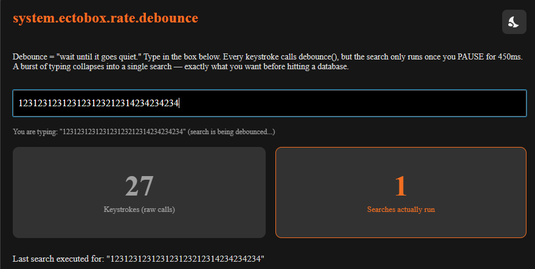
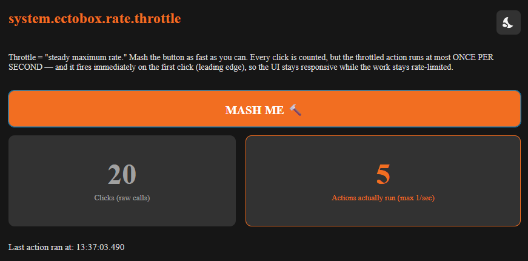

# Ecto Ignition Library

A free Ignition 8.3 module that adds Ectobox scripting utilities to the `system.*` namespace. It's a
home for small, reusable Jython helpers — starting with proper rate-limiting. Every function is fully
documented in the Designer's script editor, with real parameter names and descriptions in autocomplete.



## Install

1. Download **`EctoIgnitionLib-8.3.modl`** from the [Releases](https://github.com/Ectobox/EctoboxIgnitionModules/releases/download/modules/EctoIgnitionLib-8.3.modl) list.
2. Gateway → **Config → Modules → Install or Upgrade a Module** → pick the file (accept the Ectobox certificate on first install).
3. The functions are available immediately under `system.ectobox.rate` in both the Gateway and Designer scopes.

## `system.ectobox.rate`

| Function | What it does |
|---|---|
| `debounce(key, delayMs, function[, args])` | Runs `function` once `delayMs` has passed with no further calls on `key`. Coalesces bursts into a single action. |
| `throttle(key, intervalMs, function[, args])` | Runs `function` immediately, then suppresses calls for `intervalMs`. The most recent call during the window fires once when it closes. |
| `cancel(key)` | Cancels a pending debounce (and clears throttle state) without running the function. Returns `True` if something was pending. |
| `flush(key)` | Runs a pending call right now instead of waiting — a pending debounce and/or a throttle's queued trailing call. Returns `True` if anything fired. |

`function` is any callable — a `def`, `lambda`, or bound method. Give it arguments either by closing
over what you need or by passing an `args` list/tuple. `debounce` and `throttle` return the `key`, so
you can keep it to `cancel`/`flush` later.

### Examples

```python
# Debounce: only refresh after the user stops clicking for half a second.
def send():
    system.perspective.sendMessage("refresh", {"target": target},
                                   sessionId=sessionId, pageId=pageId)
system.ectobox.rate.debounce(sessionId + "::refresh", 500, send)

# Debounce with args instead of a closure.
system.ectobox.rate.debounce("recalc", 300, recalcTotals, [orderId])

# Throttle: write to a tag at most once per second while a value chatters.
system.ectobox.rate.throttle("tank1::level", 1000, updateHistorian, [newLevel])
```


### How `key` works

Calls that share a `key` are the same debounce/throttle. Pick a string that identifies the *action*
and its context — e.g. `sessionId + "::refresh"` keeps each Perspective session independent. Reusing
a key across unrelated actions will make them coalesce; that's the whole mechanism.

## Behavior notes

- **Threads:** timing and execution are split across two pools. A single-thread scheduled executor
  handles *timing only* — when a timer elapses it hands the callback to a cached execution pool, which
  takes microseconds, so one timing thread drives every key. The cached pool has zero core threads and
  spins up a worker per callback that needs to run right now, reclaiming it after 30s idle — so a slow
  callback can never delay the *timing* of another key, and an idle gateway holds zero live threads.
  Scheduling and cancelling are O(1); no thread ever sleeps out a delay.
- **Where the callable runs:** on a background worker thread — *except* a throttle's leading edge and
  `flush`, which run synchronously on the caller's thread (they're meant to fire immediately). For
  gateway/Perspective calls, pass explicit context (e.g. `sessionId`/`pageId`, tag paths) rather than
  relying on the calling thread's context, keep the callback short, and offload heavy work.
- **Timing source:** throttle intervals use a monotonic clock (`System.nanoTime()`), so a system
  clock/NTP adjustment won't make a window fire early or stall.
- **Scope isolation:** the module registers in the Gateway and Designer scopes, each with its own
  independent registry (they run in separate JVMs). A gateway event and a Designer-console test with
  the same key do not collide.
- **Errors:** exceptions thrown by your function are logged under the `EctoIgnitionLib.Rate` logger
  and swallowed, so one bad run can't take down the scheduler.
