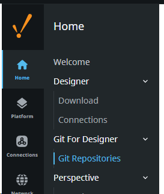
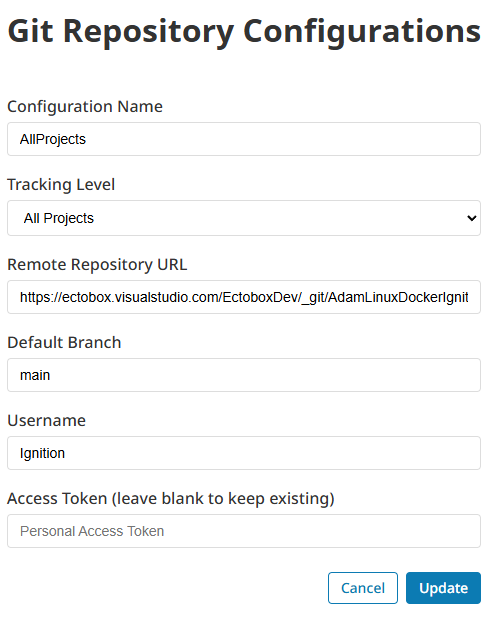
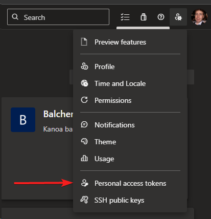
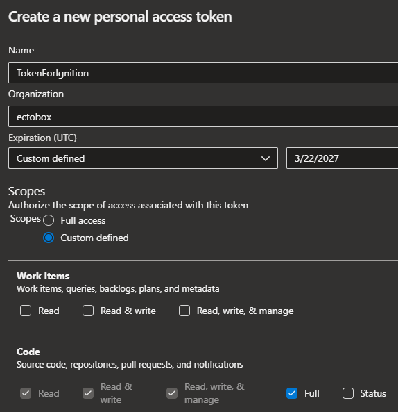
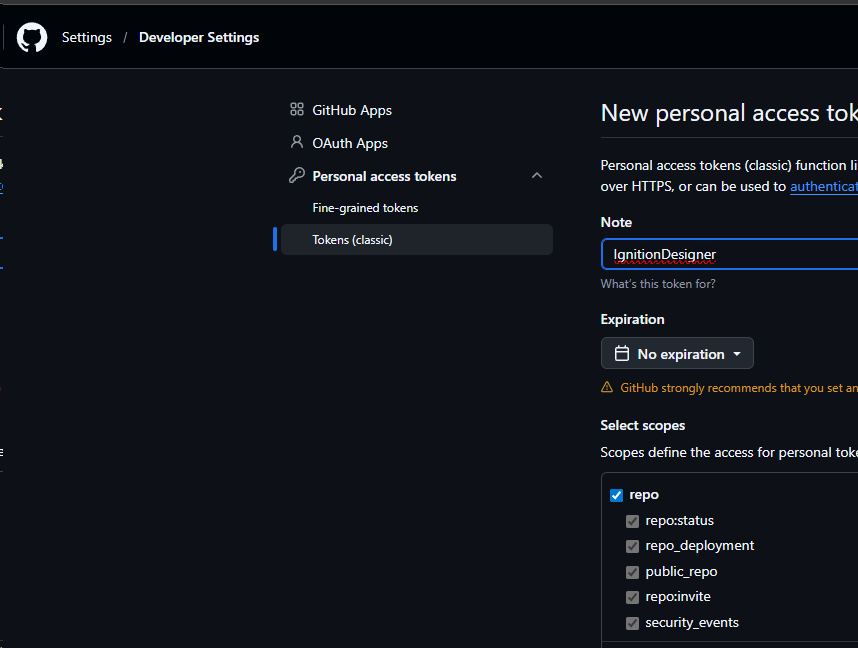
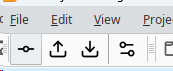
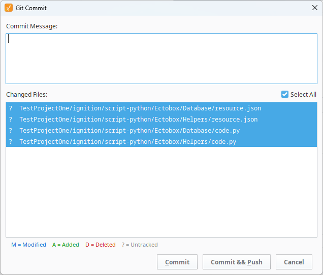
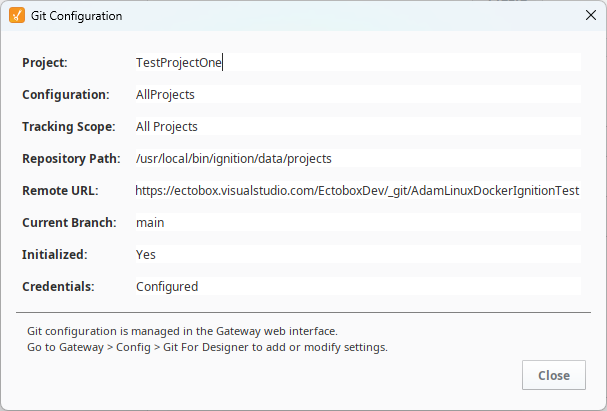

**⬇ [Download the latest module (v1.0.17)](https://github.com/Ectobox/EctoboxIgnitionModules/releases/download/modules/Git-For-Designer-8.3.modl)**

Working without source control is like climbing a rock face without a rope.  Doable but when something goes wrong it is going to hurt pretty bad.
Having to remote into the box Ignition is on or trying to set it up with a trimmed down docker vm can range from inconvient to waking nightmare.  So we built an easy button.

Once you install the module you'll have a new option in the gateway admin:

Create a new configuration: 

The username doesn't matter just put something in.

You can create a personal access token here on DevOps: 

Make sure to push the expiration out by a year and to give code permissions:

You can do the same thing in Github:

The buttons appear like:

The First button will give you a Commit window with an option to Push as well.  

You can click on individual files or shift click to highlight several in a row or control click to select multiple files one by one.  Any file highlighted will be committed.  

The buttons next to Commit, are Push and Pull respectively and then a Settings that simply shows the git repo settings.

