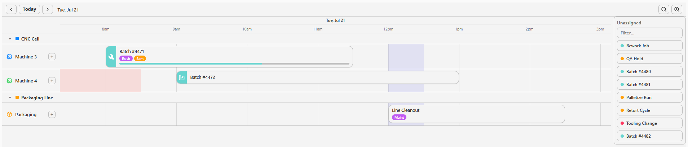
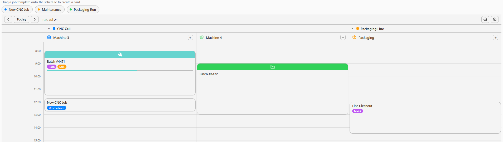
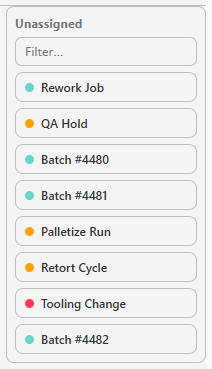
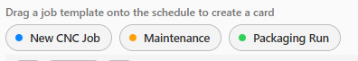
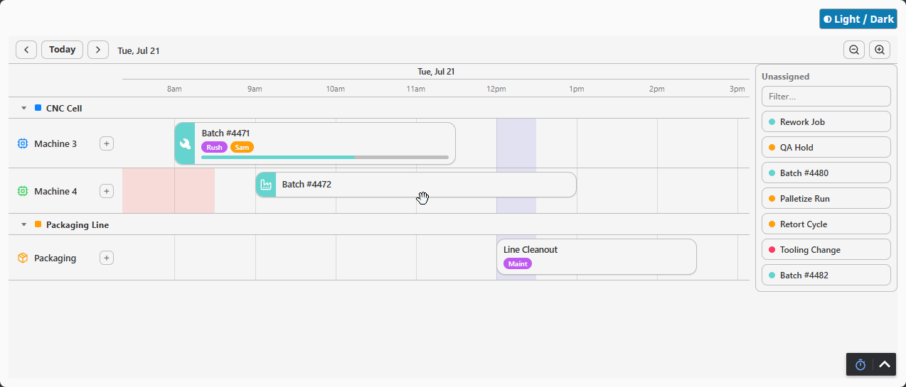
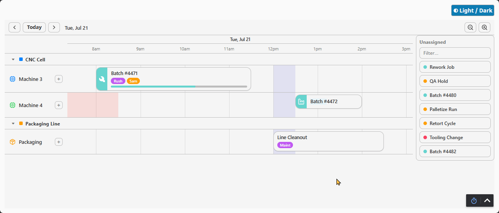
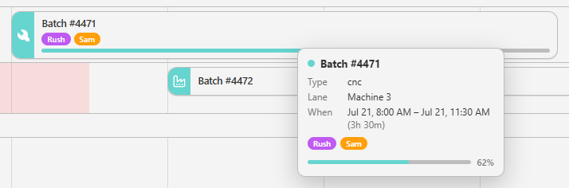
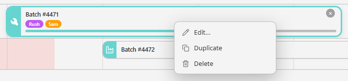
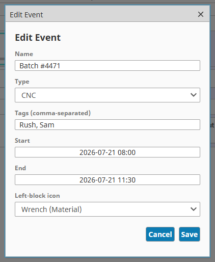
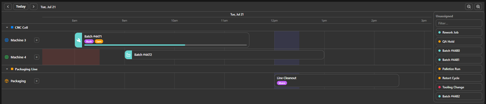

# Ectobox Schedule

A modern, Apple-clean **equipment schedule / planner for Ignition 8.3 Perspective**. Ignition's built-in
Equipment Schedule already covers a lot of ground; this is a from-scratch alternative for teams who want
a more drag-first workflow and cards that carry more information. Drag jobs between swim lanes, drop
objects onto the timeline to create cards, and dress each card with badges, a progress bar, a colored
left block with an icon, and per-lane or plant-wide state bands. Hand-built (no third-party scheduling
library), with a curated palette and automatic light/dark theming.



_Flip `orientation` to `vertical` for a calendar-style, columns-per-lane layout:_



## What's included

| Component | Component id | What it does |
|---|---|---|
| **Schedule Timeline** | `ectobox.schedule.timeline` | The scheduler: swim lanes of event cards on a time axis, with drag-between-lanes, resize, drop-to-create, badges, progress bars, and state bands. |
| **Schedule Drag Source** | `ectobox.schedule.drag-source` | A palette of draggable chips; drag one onto a Schedule Timeline to create a card — no scripting needed. |

Both appear in the Designer palette under **Ectobox Schedule**.

## Two ways to add jobs by dragging

They cover two different situations — pick whichever fits, or use both:

- **Unscheduled tray** — built into the Schedule Timeline (`trayPosition`). A dockable backlog of your
  *existing* events that have no lane or start. Drag one onto a lane and it's **scheduled in place** —
  its lane and time are set, with **no duplicate** created. Best when your data already holds
  not-yet-scheduled work orders. Add `traySearch` (an operator search box) and a dev-side `trayFilter`
  (`types` / `denyTypes` / `text`) to keep a large backlog manageable.

  

- **Schedule Drag Source** — a separate palette of **template chips** you drop onto the timeline to
  **create a new card** (the "drop to create" path). Best for "new job of type X" buttons, or when you
  want a source/tray with a fully custom layout.

  

Both use the same drop path, so the Drag Source can also stand in for a custom tray: a dropped object
whose `ID` **already matches an unscheduled event** in `events` schedules *that* event in place, while a
new `ID` creates a fresh card. Bind the Drag Source's `chips` to your unscheduled items and it behaves
like the tray, with your own layout.

## Highlights

The built-in Equipment Schedule is a capable component that fits many jobs well — this one just makes
different tradeoffs, leaning into drag-first interaction and information-dense cards:

- **Move jobs between lanes** — drag a card from one piece of equipment to another (e.g. machine 4 is
  busy, so move the batch to machine 3), with **declarative rules** for what each lane will accept.
- **Drop to create** — drag any object with at least an `ID` and `Name` onto the timeline and it
  becomes a card; optional `StartDate`/`EndDate`/`Tags`/`Color`/`Type`/`Progress`/`Icon` are honored.
- **Cards that communicate** — optional **badges** (type, owner, priority…), a **progress bar**, and a
  colored **left block with an icon** (Material, [Lucide](https://lucide.dev), or an image).
- **State bands** — per-lane spans (running / idle / down / setup) painted behind the cards, plus
  plant-wide bands for shifts and breaks; either can optionally block drops.
- **Apple-style palette, automatic light/dark** — a curated 12-color set; cards are colored by *what
  they are* (their type), so a job keeps its color when moved between lanes.
- **Horizontal or vertical** orientation, multi-select **bulk move**, and edge **resize**.

**Move a job between lanes** — drag a card from one piece of equipment to another:



**Drop, block, resize, edit** — drag a new job onto the timeline (lanes that don't accept its type turn
red and refuse it), resize it by an edge, and edit its properties:



Hover any card for full details; right-click for a configurable menu:




## Install

1. Download **`Ectobox-Schedule-8.3.modl`** from the [Releases](https://github.com/Ectobox/EctoboxIgnitionModules/releases/download/modules/Ectobox-Schedule-8.3.modl) list.
2. Gateway → **Config → Modules → Install or Upgrade a Module** → pick the file (accept the Ectobox certificate on first install).
3. In the Designer, the components appear in the palette under **Ectobox Schedule**.

## Quick start

1. Drop a **Schedule Timeline** onto a view.
2. Bind **`lanes`** (the swim lanes) and **`events`** (the cards) to named queries, tags, or scripted
   arrays — or start from the built-in sample data.
3. To let users create cards by dragging, drop a **Schedule Drag Source** nearby and set its `chips`.

```python
# lanes — the swim lanes:
[ { "id": "m3", "label": "Machine 3", "type": "cnc", "accept": { "types": ["cnc"] } },
  { "id": "m4", "label": "Machine 4", "type": "cnc" } ]

# events — the cards:
[ { "id": "e1", "laneId": "m3", "name": "Batch #4471",
    "start": "2026-07-21T08:00:00", "end": "2026-07-21T11:30:00",
    "type": "cnc", "badges": ["Rush", {"name": "Owner: Sam", "color": "orange"}],
    "progress": { "enabled": true, "value": 62 },
    "leftBlock": { "enabled": true, "icon": { "path": "lucide/factory" } } } ]
```

## Key properties (Schedule Timeline)

| Prop | Notes |
|---|---|
| `lanes` | Swim lanes. Each: `id`, `label`, `type`, `color`, `icon`, and optional `accept` rules (`types`, `eventIds`, `denyTypes`). |
| `events` | Cards. Each: `id`, `laneId`, `name`, `start`, `end`, plus optional `color`, `type`, `badges`, `leftBlock`, `progress`, `movable`, `resizable`, `lockedToLane`, `badgePlacement`. |
| `laneStates` | Per-lane state spans behind the cards: `laneId`, `start`, `end`, `state`, `color`, `label`, `blocksDrop`. |
| `globalBands` | Bands spanning all lanes (shifts/breaks): `start`, `end`, `label`, `color`, `opacity`, `blocksDrop`. |
| `timeline` | `start`, `end`, `zoom` (month/day/12-hr/8-hr/6-hr/3-hr/hours/15-min/minutes), `snapMinutes`, `showCurrentTime`, `currentTime`. |
| `navigation` | Built-in toolbar: `enabled` (prev / today / next + range label) and `showZoom`. Panning/zooming writes `timeline.start`/`end` back and fires `onRangeChanged`. |
| `timeZone` | IANA zone (e.g. `America/New_York`) for the axis labels, day/month boundaries, and card times. Empty = the viewer's browser zone. **See [Time & timezone](#time--timezone).** |
| `orientation` | `horizontal` (lanes are rows) or `vertical` (lanes are columns). |
| `overlap` | `stack` (pack overlapping cards into sub-rows) or `reject` (refuse an overlapping move/drop). |
| `addEnabled` / `moveEnabled` / `resizeEnabled` / `deleteEnabled` / `dropEnabled` | Toggle each interaction. |
| `selectedEvent` / `selectedEvents` | The current selection, written back for your bindings. |
| `badgePlacement`, `cornerRadius`, `density`, `rowHeight`, `laneHeaderWidth`, `palette`, `title` | Appearance. |

## Events

The component **optimistically updates its own `events` prop** (so bindings see changes immediately)
**and** fires a matching event so you can persist or audit:

| Event | Payload |
|---|---|
| `onEventMoved` | `eventId, fromLaneId, toLaneId, oldStart, oldEnd, newStart, newEnd, movedCount` |
| `onEventResized` | `eventId, laneId, oldStart, oldEnd, newStart, newEnd` |
| `onEventAdded` | `eventId, laneId, start, end` |
| `onEventDropped` | `eventId, laneId, start, end, source` (the raw dropped object) |
| `onEventDeleted` | `eventId, laneId` |
| `onEventClicked` / `onSelectionChanged` | `eventId, laneId` (+ `selected[]` for selection changes) |
| `onEventDoubleClicked` | `eventId, laneId, event` — open your own editor here (see below) |
| `onRangeChanged` | `start, end` — the visible window changed via the navigation toolbar |
| `onMoveRejected` | `eventId, fromLaneId, attemptedLaneId, reason` (`laneAccept` / `denyType` / `stateBandBlocked` / `lockedToLane` / `notMovable` / `overlap`) |
| `onDataError` | `count, problems[]` — bound data has issues (see [Data integrity](#data-integrity)). Fires again only when the set changes; log it to the gateway here. |

## Editing cards

The component is intentionally **unopinionated about editing** — rather than a fixed built-in form, it
fires **`onEventDoubleClicked`** so you can open your own editor (a popup, a docked panel, whatever
fits). Bind the schedule's `events` to something writable (a session/view custom property, a tag, a
named-query-backed dataset), open your editor on double-click, and on save update that backing store —
the schedule re-renders from the bound value. `selectedEvent` tells your editor which card is active.



**Worked example — a double-click popup editor.** Bind `events` to `view.custom.events`
(bidirectional, so drags/resizes persist too). On `onEventDoubleClicked`, open a small popup editor,
passing each field as its own **top-level scalar param** (not one object param — Perspective popups
populate scalar params only):

```python
# onEventDoubleClicked  (event has eventId / laneId / event)
eid = event['eventId']
evt = next((e for e in self.view.custom.events if e['id'] == eid), None)
if evt:
    system.perspective.openPopup('evtEditor', 'Schedule/EventEditor',
        params={'id': evt['id'], 'name': evt['name'], 'type': evt.get('type',''),
                'start': evt['start'], 'end': evt['end']},
        title='Edit Event', modal=True, showCloseIcon=True)
```

In the editor view, declare each param with `propConfig["params.name"] = {"paramDirection": "input"}`
and bind each field to `view.params.<field>` to **populate** it (openPopup only fills top-level scalar
params — a nested `view.params.event.name` path won't populate). On **Save**, read the field
components' **live values** (an openPopup-injected param does not accept a bidirectional write-back, so
read the inputs directly), send them, and let the schedule's view update its store:

```python
# Save button — read the input components, not the params
root = self.parent.parent            # buttons flex -> root
def fld(group, field):
    return root.getChild(group).getChild(field)
def toIso(ms):
    return None if not ms else system.date.format(system.date.fromMillis(long(ms)), "yyyy-MM-dd'T'HH:mm:ss")
payload = {
    'id':    self.view.params.id,
    'name':  fld('nameGroup', 'nameField').props.text,
    'type':  fld('typeGroup', 'typeField').props.value,      # dropdown
    'start': toIso(fld('startGroup', 'startField').props.date),  # date-time-picker (ms)
    'end':   toIso(fld('endGroup', 'endField').props.date),
    'iconPath': fld('iconGroup', 'iconField').props.value,
}
system.perspective.sendMessage('ecto.sched.saveEvent', payload=payload, scope='page')
system.perspective.closePopup('evtEditor')

# 'ecto.sched.saveEvent' handler on the schedule's view — merge edited fields by id:
edited = system.util.jsonDecode(system.util.jsonEncode(payload))
events = system.util.jsonDecode(system.util.jsonEncode(self.view.custom.events))
for e in events:
    if e['id'] == edited['id']:
        for k in ('name', 'type', 'start', 'end'):
            if edited.get(k) is not None:
                e[k] = edited[k]
        e['leftBlock'] = {'enabled': True, 'icon': {'path': edited['iconPath']}} if edited.get('iconPath') else {'enabled': False}
self.view.custom.events = events
```

## Persisting changes

The schedule is **optimistic**: a drag, resize, add, or delete updates its own `events` prop
immediately, so the UI never waits on a round-trip. To make those changes *stick*, bind `events` to
something writable and save on the matching event — exactly like the Drag List module's reorder demo.

The simplest binding is a **view/session custom property** (survives while the session lives):

```python
# onEventMoved / onEventResized / onEventAdded / onEventDropped / onEventDeleted  (all the same one line)
self.view.custom.events = self.props.events
```

To **persist to a database** so edits survive a reload, write back on those same events with a named
query (or `system.db.runPrepUpdate`) and let the binding refresh:

```python
# onEventMoved  — event payload has eventId, fromLaneId, toLaneId, newStart, newEnd, ...
e = self.props.events[[i for i,x in enumerate(self.props.events) if x['id'] == event['eventId']][0]]
system.db.runNamedQuery('schedule/upsertEvent', {
    'id':     e['id'],
    'laneId': e['laneId'],
    'start':  e['start'],
    'end':    e['end'],
})
# onEventDeleted:  system.db.runNamedQuery('schedule/deleteEvent', {'id': event['eventId']})
```

Point `events` at a `SELECT` named query (id, laneId, name, start, end, …) and the schedule re-renders
from the database as your writes land. Because the update already happened optimistically, the save is
just durability — a failed write can be caught and surfaced without the UI ever feeling laggy.

## Time & timezone

Card **positions** are pure timestamps, so they're always correct. The one thing that's wall-clock —
the axis labels, the day/month boundaries the gridlines snap to, and displayed times — is controlled by
`timeZone`:

- **Empty (default):** the viewer's **browser** timezone.
- **An IANA zone** (`America/New_York`, `Europe/Berlin`, `Asia/Tokyo`, …): the axis renders in that
  zone, so every operator sees the same clock regardless of where their browser is.

For a plant floor you almost always want a **fixed** zone rather than each browser's local time. The
recommended setup is to bind `timeZone` to the Perspective session so it follows your gateway/session
configuration:

```
timeZone  ⟵  binding (property)  session.props.timeZone
```

That way a schedule authored in one timezone reads correctly for everyone, and daylight-saving shifts
are handled for you.

## Data integrity

The schedule **never drops bad data silently** — every event stays visible and is flagged:

- **Missing `id`** → the card lands in a **⚠ Unassigned** strip, red and locked; it can't be placed
  until it's given a distinct id (ids are how you tie a card to a work order, so they're required).
- **`laneId` that matches no lane** → red **"Unknown lane"** card in the Unassigned strip (drag it onto
  a real lane to fix it).
- **`end` before `start`, an unparseable date, or a duplicate `id`** → the card renders **red** in place
  with the reason ("End before start", "Bad date", "Duplicate ID").
- **No `start` / no `laneId`** (not an error) → shown in the Unassigned strip as *unscheduled*.

Every problem is also logged to the browser console and reported through **`onDataError`** (which fires
only when the problem set changes) so you can log it to the gateway:

```python
# onDataError  — payload: count, problems (each: id, laneId, code, message)
log = system.util.getLogger('Schedule')
for p in event['problems']:
    log.warn('Event %s (lane %s): %s' % (p['id'], p['laneId'], p['message']))
```

## Colors, badges & icons

- **Card color** comes from the event's `type` (a curated palette color), so all "maintenance" cards
  share a color and a job keeps its color across lane moves. Set an explicit `color` to override.
- **Badges** are an array of strings (auto-colored, stable per label) or `{ name, color }` where color
  is a hex or a palette name (`blue`, `green`, `orange`, …).
- **Icons** (left block + lane headers) use a `path`: `material/<name>`, `lucide/<name>`
  ([Lucide](https://lucide.dev), rendered stroked), or an image URL / data URI.

## Theming & CSS

Surfaces, text, and gridlines follow Perspective's theme variables (`--neutral-*`, `--container`), so
**light/dark is automatic**.


 The palette is exposed as CSS custom properties you can override globally:

```css
:root {
  --ecto-sched-1: #0a84ff;   /* type/series color 1 */
  --ecto-sched-2: #ff9f0a;   /* ... up to --ecto-sched-12 ... */
}
```

Everything drawn is a prefixed class you can restyle: `.ecto-sched__card`, `.ecto-sched__badge`,
`.ecto-sched__progress`, `.ecto-sched__state`, `.ecto-sched__band`, `.ecto-sched__lane`, and more.
