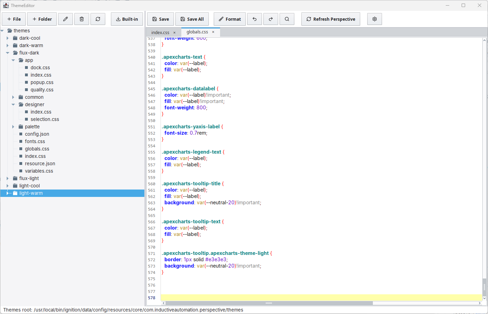
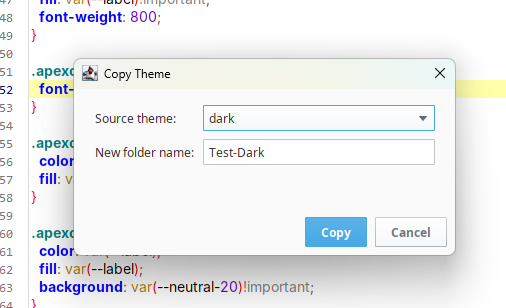
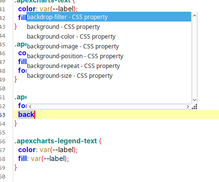
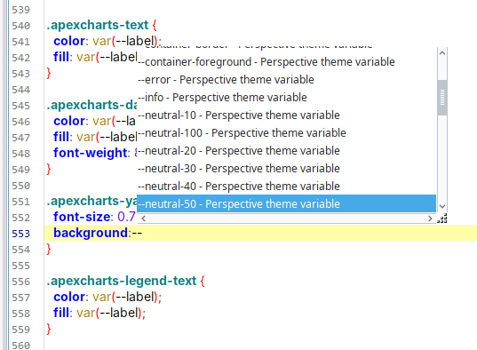
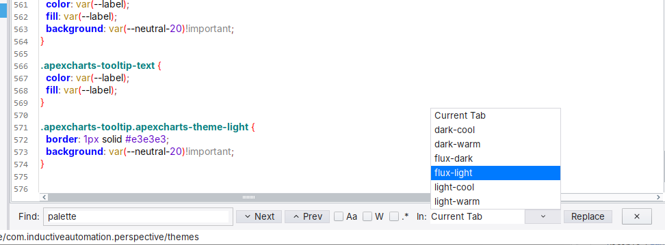
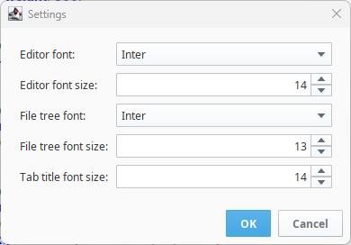

# Themes Editor

**⬇ [Download the latest module (v1.0.1)](https://github.com/Ectobox/EctoboxIgnitionModules/releases/download/modules/Themes-Editor-8.3.modl)**

A designer-side editor for Ignition Perspective theme files (CSS/JSON) — no filesystem access required.

---

## Why

Editing Perspective themes in Ignition 8.3 is rough. There's no theme editor in the Designer, so you need OS-level access to the gateway server (which many designers don't have) and even then you're stuck editing CSS and JSON in some external editor with no intellisense, no syntax highlighting, and no good way to search across your theme files, your changes don't take effect until Perspective re-scans the themes directory, which means a lot of guesswork and waiting.

This module gives you a proper editor right inside the Designer. Browse, open, edit, format, and save theme files on the gateway — with syntax highlighting, CSS autocomplete, powerful find, and a one-click "Refresh Perspective" button so your changes show up in the browser immediately.

---

## Features

- **File/folder tree** — browse the gateway's themes directory with create, rename, and delete operations.
- **Tabbed multi-file editor** — CSS syntax highlighting, JSON support, dirty markers, undo/redo.
- **CSS autocomplete** — standard CSS properties, values, functions, and 100+ Perspective theme variables.
- **CSS/JSON formatting** — one-click pretty-print (Ctrl+H).
- **Find/Replace** — search the current file or all files in a theme, with regex support.
- **Copy Built-in Themes** — one-click copy of `light`, `dark`, or any built-in theme into your custom themes folder.
- **Refresh Perspective** — push your changes to active web sessions without restarting the gateway (F5).
- **Customizable fonts** — pick your editor font, font size, tree font, and tab title font size.
- **Keyboard-driven** — `Ctrl+S` save, `Ctrl+Shift+S` save all, `Ctrl+F` find, `Ctrl+H` format, `F5` refresh, `Shift+F12` open from anywhere.

---

## Screenshots

---

## Installation

### Prerequisites

- Ignition 8.3.x gateway
- Designer access with module installation permission (or ask your gateway admin)

### Steps

1. Download the latest `Themes-Editor.modl` from the [Releases page](https://github.com/Ectobox/IgnitionThemesEditor/releases).
2. In the Gateway Configuration web UI, go to **Configuration > Modules**.
3. Click **Install a Module**, select the `.modl` file, and install.
4. Restart the gateway when prompted.
5. Open the Designer — you'll find **Tools > ThemeEditor** (or press `Shift+F12`).

### Upgrading

Install the new `.modl`, and restart the gateway when prompted.

---

## Usage

### Opening the editor

- Menu: **Tools > ThemeEditor**
- Hotkey: **Shift+F12**

### Keyboard shortcuts

| Shortcut | Action |
|---|---|
| `Shift+F12` | Open Themes Editor |
| `Ctrl+S` | Save active file |
| `Ctrl+Shift+S` | Save all open files |
| `Ctrl+F` | Find/Replace |
| `Ctrl+H` | Format document (CSS/JSON) |
| `Ctrl+Z` | Undo |
| `Ctrl+Shift+Z` | Redo |
| `F5` | Refresh Perspective (reload themes in active sessions) |

### Editing workflow

1. Open the editor (`Shift+F12`). The file tree on the left shows your gateway's themes directory.
2. **Start from a built-in theme** — click the Built-in button in the tree toolbar, pick `light` or `dark`, give it a name, and click OK. This copies the full built-in theme into your custom themes folder.
3. **Or create from scratch** — create a new folder and files using the tree toolbar buttons.
4. Double-click any `.css` or `.json` file to open it in a tab on the right.
5. Edit with CSS syntax highlighting, autocomplete, and formatting.
6. Press `Ctrl+S` to save, then `F5` to refresh Perspective so your changes appear in the browser immediately after a refresh.

### File operations

The toolbar above the file tree provides buttons to:
- **New Folder** — create a subfolder inside the current selection.
- **New File** — create a `.css` or `.json` file (type the extension).
- **Copy Built-in Theme** — copy `light`, `dark`, or any built-in theme into your themes folder.
- **Rename** — rename the selected file or folder.
- **Delete** — delete the selected file or folder.
- **Refresh tree** — reload the tree (useful if files changed externally).

All operations are validated server-side — you can't navigate outside the themes directory.

---

## Caveats

- **Concurrent edits**: If two designers edit the same file at the same time, the last save wins. There's no merge or conflict detection in this version.
- **File types**: The editor handles `.css` and `.json` files. Other file types in the themes directory (like images) are visible in the tree but won't open in the editor.

---
